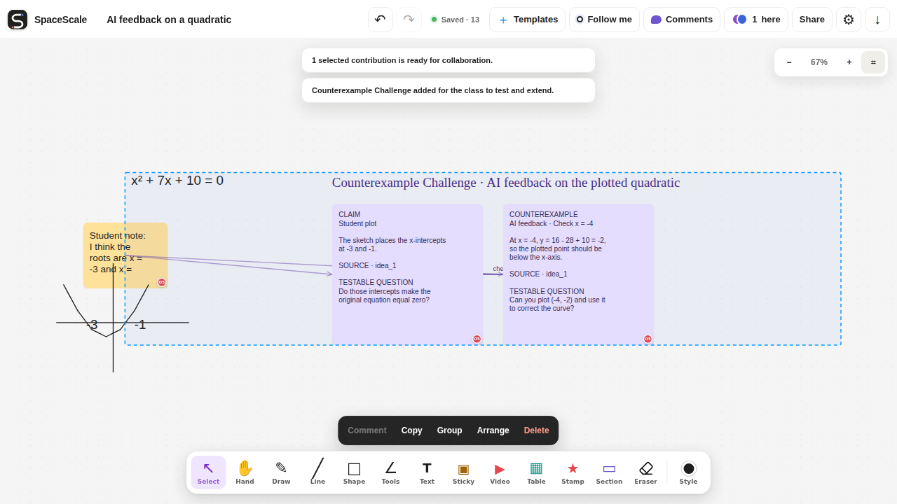

# SpaceScale

**A live, collaborative environment where people and AI agents work
together—built for education and adaptable to any team.**

[Live demo](https://webmcp.spacescale.net/) ·
[Hackathon pitch](docs/hackathon-build/pitch.md) ·
[Codex skills for teachers](.agents/skills/README.md) ·
[Devpost submission draft](devpost-submission.md) ·
[3-minute demo runbook](docs/hackathon-build/demo-runbook.md) ·
[Implementation spec](docs/hackathon-build/spec.md) ·
[MIT license](LICENSE)

SpaceScale turns classroom AI from a text reply into visible collaboration.
Students and teachers draw, write, organize, embed videos, react, and vote
together. A compatible AI host discovers fourteen WebMCP tools from the open board,
reads or follows the whole board, a selection, or one person's work, catches
reasoning errors, writes comments, notes, pictures, and videos, and gathers
related notes together — all of it visible, and all of it something everyone can
discuss, revise, and undo.



## Why WebMCP matters here

The useful context is not hidden in a backend API. It is the live state already
under a participant's hand: their current canvas selection, a spatial sketch,
the latest saved reasoning step, or an aggregate class vote. WebMCP lets the
visiting agent use that exact page context without DOM automation, a browser
extension, or a separate MCP server.

The result is collaborative rather than conversational-only:

- **Visual collaboration:** AI contributions become ordinary, source-linked
  canvas objects that appear to every participant in real time.
- **Handwriting and sketch support:** the board watch carries a PNG of the board
  whenever it holds drawn work, so the agent can read strokes and spatial context,
  identify a possible reasoning error, and comment on it where the class can act.
- **Video support:** participants can place public YouTube and Vimeo material on
  the shared canvas, then discuss it beside notes, drawings, formulas, comments,
  and AI-generated structures. A comment can carry a picture or a video of its
  own, so feedback can show the worked example rather than describe it.
- **Live learning loops:** the agent can watch the board's saved work for up to
  15 minutes, answer a participant's request on the step they asked about, and
  read an aggregate class vote without ever seeing who voted for what.
- **Participant-scoped permissions:** a WebMCP write enters the same
  `commitAndWait` path as the authorizing participant's own edit. The agent gets
  no service account and no elevated identity.

## Permission inheritance

SpaceScale does not give the agent a parallel authorization system. WebMCP tools
run in the signed-in browser session and use its actor ID, role, durable outbox,
WebSocket commit protocol, and server acknowledgement. Client checks give fast
feedback; the Cloudflare Worker revalidates roles, ownership, section locks,
versions, and the complete atomic batch before saving it.

| Authorizing participant | Effective WebMCP write access |
| --- | --- |
| Owner or co-owner | May change unlocked board content, exactly like that participant can in the UI. |
| Editor | May create new content and change only content they created; copying creates a new editor-owned object. |
| Viewer | Read-only. WebMCP write tools cannot commit. |

Every accepted agent-assisted batch is attributed to the responsible
participant, saved through the authoritative reducer, broadcast in real time,
and undoable. Internal origin metadata records that WebMCP assisted the content
without replacing participant authorship or adding privileged AI-only objects.

## What was built for the WebMCP Challenge

SpaceScale started from the open-source
[Cloudflare Collab Canvas](https://github.com/stayqrious/cloudflare-collab-canvas)
foundation. During the challenge period, it was extended into a classroom
collaboration product with:

- fourteen discoverable WebMCP tools: one reading or a bounded live watch of the
  whole board, the browser selection, or a named participant's work, a
  participant list, an aggregate vote reader, a template reader, four generic
  inserts, a filled-template insert, and a sticky-note move;
- permission-aware, acknowledged, realtime, atomic, and undoable writers that
  place one object where the call asks, or gather notes already on the board
  into one undoable rearrangement;
- shared YouTube/Vimeo cards, MathJax learning content, comments that carry a
  picture or a video, grouping, sections, templates, and live participant roles;
- contract, unit, edge, and Chromium coverage for the permission and WebMCP
  boundaries.

The complete technical delta and safety constraints are documented in the
[implementation spec](docs/hackathon-build/spec.md).

## Try the judge path

1. Open the [public demo](https://webmcp.spacescale.net/) in ChatGPT's in-app
   browser or another compatible WebMCP host and create a Space.
2. Write `x² + 7x + 10 = 0`, deliberately sketch the wrong intercepts `-3` and
   `-1`, and add a sticky with that student claim.
3. Select the visual work and ask the agent to inspect the graph. Then select
   the claim sticky and ask: “Add a counterexample that checks `x = -4` and asks
   the student to correct the plot.”
4. Confirm the WebMCP-generated feedback card shows `y = -2` at `x = -4`, links
   back to the student's claim, appears for collaborators, and disappears with
   one undo.
5. Open the board as a viewer and repeat the write request to verify that the
   agent cannot exceed that participant's permissions.
6. Use **Video** to add a public YouTube or Vimeo link and show that it remains a
   normal shared, selectable, persistent canvas object.

For the recording-ready sequence, exact prompts, recovery prompts, and timing,
see the [demo runbook](docs/hackathon-build/demo-runbook.md).

## Architecture at a glance

The browser renders gestures optimistically. One `BoardRoom` Durable Object per
board validates, sequences, persists, and broadcasts each durable action through
the shared reducer. SQLite is authoritative; private R2 objects hold image
assets, immutable recovery checkpoints, and named snapshots. The app still
works as a collaborative canvas when `document.modelContext` is unavailable.

## Product capabilities

Alongside freehand drawing, shapes, and plain text, the board supports durable
sticky notes for brainstorming, exit tickets, sorting, and feedback. Choose
**Sticky note** or press `N`, click the board, and type immediately. A note may
be left empty, uses a 180 × 140 board-unit default size, and can be recolored
with the six SpaceScale presets while creating it or after selecting it. Saved
sticky notes, image cards, tables, and sections expose direct resize handles.

Sticky notes participate in the same authoritative collaboration pipeline as
every other board item: they can be selected, moved, copied, deleted, undone,
redone, restored from snapshots, replayed from the offline outbox, and exported
to canonical JSON or safe SVG. Double-click a note—or double-tap it with the
select tool—to edit its wrapped text.

For quick visual feedback, choose **Stamp** or press `K`. Pick a star, check,
heart, question mark, smile, or sparkle in the palette, choose a colour, then
click or tap the board to place a compact 36-unit stamp. Stamps are local SVG
marks with accessible labels and no external image dependency.

Stamps are durable board items too: every participant sees them in real time,
and they support selection, movement, copy/delete, undo/redo, offline recovery,
snapshots, and JSON/SVG export.

Saved sticky notes, image cards, and stamps show the creator's initials. Hovering
the item reveals the creator's signed display name. The Worker uses only an
opaque actor ID for durable attribution; it does not store or expose the raw
stable user identifier.

Space owners can choose **Attributed data JSON** from the export menu to download
the current authoritative objects together with participant names and normalized
text attribution. Creator and content author are reported separately: for a
sticky, text item, image description, or section title, the responsible user is the
last participant who authored the current value; table cells are attributed
individually. The same owner-only data is available to trusted backends at
`GET /api/v1/boards/<board-id>/export.attributed.json`. It contains opaque actor
IDs and display names, never raw email addresses or `participant_id` values.

Owners can also enable private **Image cards** for a board. Editors then upload,
paste, or drop PNG, JPEG, WebP, and static GIF images; the browser removes photo
metadata before upload and the Worker validates the decoded format, dimensions,
content hash, role, lock state, and per-board quotas. Only immutable asset
metadata enters board actions and snapshots. Raw bytes stay in the private
`BOARD_ASSETS` R2 binding and are fetched through authenticated board URLs.

Image cards use contain sizing, loading/error fallbacks, editable alt text, and
the same selection, movement, copy/delete, persistence, and real-time controls
as other items. Safe SVG export uses a placeholder rather than leaking a private
asset URL or identifier.

For lightweight learning grids, choose **Table** or press `G`, select 1–6
columns and 1–8 rows in the blocking chooser, optionally enable a header row,
then choose a location on the board. Placement returns to **Select**. A selected
table exposes a lower-right whole-table handle plus draggable row and column
edge grips. Each cell contains plain text only; double-click or double-tap a
cell (or press `Enter`/`F2` on a selected table) to edit it. Tables use the same
real-time, role/lock, copy/delete, snapshot, replay, and safe JSON/SVG export
behavior as the other durable board items.

Owners and editors can select **Follow me** to share their live canvas position
and zoom with the Space, including while drawing is locked. Participants may
press `Esc` or choose **Stop** to leave that Spotlight session; a later session
can be followed normally. Spotlight traffic is ephemeral and never enters board
history, snapshots, exports, or the offline outbox.

The **Templates** menu includes five built-in starter layouts—Exit ticket,
K-W-L, Sort it, Pair share, and Vote with stamps—as ordinary attributed item
batches. Owners of an organisation-managed Space can also save a selection as
an organisation template. Those templates appear in every Space signed for the
same Organisation and remain isolated from every other Organisation.
Vote totals are derived live from each participant's latest stamp in the vote
table and are not stored in board history or exports. Only owners receive the
bulk **Clear votes** action; the underlying stamps remain ordinary board items.

Choose **Section** or press `Z` to add a labelled 520 × 320 work area. Its title
and border are selectable while the interior remains transparent to items
inside it. A selected section has a lower-right handle for changing its width and
height. Multi-selection also offers atomic **Arrange** actions to align or
distribute items and tidy selected sticky notes into a deterministic grid.

Choose **Line** or press `L` to draw a line, then enable **End arrow** when a
one-way connector is useful. New line endpoints snap to nearby cardinal points
on shapes, sticky notes, tables, image cards, and sections. V1 stores the snapped
coordinates as ordinary line geometry, so moving the target later does not move
the connector automatically.

Codex and other compatible browser hosts discover fourteen WebMCP tools directly from every
board browser. Six read: `read_board`, `read_selection` and `read_user` each take one reading
of a scope; `list_users` names the people with saved work and hands back the participant IDs
the user tools take; `read_live_class_vote` reports aggregate counts; `read_templates` lists
the board's activity templates. Two follow the same three scopes live: `watch_board`, with
`scope` board or selection, and `watch_users`. Six write: `insert_comment`, `insert_sticky`,
`insert_image` and `insert_video` each add one object; `insert_filled_template` adds a whole
template with its text slots filled in; and `move_stickies` rearranges notes already on the
board.

A scope is the same question whether you read it once or follow it, so a read and a watch
never disagree about what is in it. A board watch takes in work saved after it begins; a
selection watch is the fixed set the participant chose; a participant watch follows those
people wherever their work sits, including what they save while it runs, and never reports
anyone else's objects. `list_users` is built from saved board content, so someone with no saved
work does not appear, and its object counts describe how much work exists, never how well
anyone is doing.

Each insert takes a board location and the content it needs, and lands one object as a single
acknowledged realtime command. `insert_filled_template` is a two-call
flow: `read_templates` names a template's text slots, and the write passes that templateId
with the slot fills, landing the whole template as one batch. `move_stickies` takes a list
instead: each entry names a sticky note, by an alias a live watch reported or by a point the
note covers, and gives either an absolute destination for its centre or a relative shift in
board pixels. The whole
rearrangement lands as one batch, so a class puts the board back with a single undo, and the
result reports where every note started and where it now sits. Moving a note changes only its
position: it keeps its author and is not marked as AI-written. Write tools use the board's
normal edit permission and cannot bypass read-only access, and each refuses an object kind the
Space owner has switched off.
`insert_image` never fetches an external URL: it accepts inline PNG, JPEG, WebP, or GIF data
and reuses the private board-asset pipeline that a participant's own upload goes through.
`insert_comment` attaches to a watched step by `watchToken` and `stepAlias`, to whatever saved
object covers the location it names, or to the one object selected in that browser, and may
carry one picture or one public video with its text—the same material the canvas takes,
through the same asset pipeline and the same link check, so a reply can show the diagram or
the clip it is talking about right beside the work. Everything the
agent writes—notes, pictures, embeds, and comments—retains `assistedBy` metadata for MCP
context and auditing, is attributed to the responsible participant's ordinary author initials,
and carries a small AI mark so tool and human are always distinguishable. Every generated
contribution is realtime and undoable in one step.

The board watcher reports authoritative saved changes to the visiting host in bounded long
polls, so Codex can respond after each step changes. It follows saved objects of any kind:
written work carries its text, and handwriting, shapes, images and embeds carry a short
description plus their saved version, and every result about a board holding drawn work
also carries a PNG of the board so handwriting can be read directly. Starting a watch
follows the whole board, and while a watch is live the tool rail offers an **AI** action
that hands the whole board over with a task prompt. The board header reports whether a
WebMCP host is linked and how many tools it can see. The watcher never captures unsaved
keystrokes, expands a selected section into its contents, or returns stable board/item IDs.
While a watch is live the board shows an **Ask AI** button in the selection toolbar: the
participant picks a watched step and an action (Explain, Ideate, Critique, Check my work,
Examples, Explain with a video) and the request reaches the host through the watch's next
long poll with a reply plan naming the write to answer with. The public deployment is a
hackathon demo for synthetic or otherwise non-sensitive content; real classroom rollout
remains subject to the [classroom AI safety and implementation
gate](docs/classroom-ai-safety.md).

## Local development

Requirements: Node.js 22.19 or newer. Local development uses Miniflare-backed
Durable Objects and R2. The first setup creates `.generated/.dev.vars` with fresh private
signing values and later runs validate and reuse it. It does not need a
Cloudflare account, API token, account ID, or production `.env` values.

```sh
npm install
npm run dev
```

The application starts at `http://localhost:8787`. For the browser suite, install
the configured browsers once; the test command builds the web assets and starts
the same credential-free local Worker automatically:

```sh
npx playwright install
npm run test:e2e
```

The E2E suite depends on a locally started HTTPS Cloudflare Worker. On flaky or
resource-constrained infrastructure, a Worker startup or connection failure can
cascade into many connection-refused or TLS errors and skipped tests. If that
happens, rerun the affected spec or the full suite on stable infrastructure;
repeatable assertion failures should still be treated as product regressions.

Useful checks:

```sh
npm run typecheck
npm test
npm run test:edge
npm run test:e2e
npm run load:smoke
npm run security:scan
npm run cf:types
npm run build
npm run check
```

Run the focused checks relevant to a change during normal development. The full
`npm run check` runs automatically in CI and is the required gate for pull
requests into `main`; running it locally before opening one avoids a failed
check. The Playwright suite stays manual-only and is not a release gate: CI runs
it only on an explicit workflow dispatch. `npm run build` verifies the production
bundle with `wrangler deploy --dry-run`; on a checkout without deployment details
it substitutes non-deployable `dry-run` placeholders for `DEPLOYMENT_NAME`,
`APP_HOSTNAME`, and `TURNSTILE_SITE_KEY`, while `deployment:init` keeps strict
validation.

## Cloudflare setup

Cloudflare credentials are needed only for provisioning, validating, or deploying
a hosted environment. `.env.sample` is the source of truth for those configuration
names. Real secrets and resolved resource names must never be committed, printed
in logs, or exposed to browser code. Copy `.env.sample` to ignored `.env`,
`.env.staging`, or `.env.production`, then replace every required placeholder.
`deployment:init` loads the selected environment file before `.env`, validates
all required details, and only then creates configuration or Cloudflare resources.
Production secrets are installed with Wrangler encrypted secrets or the
Cloudflare deployment API.

### Variables

| Name                           | Purpose and acquisition                                                                                                                                                                                                                              |
| ------------------------------ | ---------------------------------------------------------------------------------------------------------------------------------------------------------------------------------------------------------------------------------------------------- |
| `DEPLOYMENT_NAME`              | Required lowercase installation name, 3–42 characters using letters, numbers, and internal hyphens. Initialization combines it with the selected environment to derive every Worker and bucket name.                                                 |
| `R2_BUCKET_JURISDICTION`       | Optional R2 jurisdiction: `default`, `eu`, or `fedramp`.                                                                                                                                                                                             |
| `TURNSTILE_SITE_KEY`           | Production public site key from **Cloudflare Dashboard → Turnstile → widget → Site Key**. It may be exposed to the browser. Staging deliberately omits it because Turnstile is disabled there for browser automation.                                |
| `SESSION_SIGNING_KEY_CURRENT`  | Secret HMAC key for device sessions. Generate independently per environment with `openssl rand -base64 32`.                                                                                                                                          |
| `SESSION_SIGNING_KEY_PREVIOUS` | Optional prior session key, accepted only during rotation. Leave empty on a new installation.                                                                                                                                                        |
| `ORGANISATION_SIGNING_KEYS`    | Secret JSON registry of Organisation-specific HMAC keys. Each entry has a stable `derivation_key`, a `current` launch key with `key_id`, and optional `previous` keys for rotation. Generate every key independently with `openssl rand -base64 32`. |
| `APP_HOSTNAME`                 | Public hostname only—no scheme, path, query, or trailing slash. Example: `whiteboard.example.com` or a `workers.dev` hostname.                                                                                                                       |
| `ALLOWED_ORIGINS`              | Comma-separated exact HTTPS origins allowed to embed `/embed`. Missing, blank, or invalid configuration denies all framing; a literal `*` explicitly allows every parent.                                                                            |
| `WEBHOOK_ALLOWED_ORIGINS`      | Comma-separated exact public HTTPS origins approved to receive attributed board webhooks. Missing or blank denies all webhook configuration/delivery; wildcards are not supported.                                                                   |
| `BOARD_CREATION_ENABLED`       | Public fail-closed operational switch. `true` permits new boards; `false` preserves existing-board read/reconnect/export routes while rejecting creation.                                                                                            |
| `TURNSTILE_ENABLED`            | Public environment switch. Use `true` only when the matching site and secret keys are configured.                                                                                                                                                    |
| `CLOUDFLARE_ACCOUNT_ID`        | Account ID from **Dashboard → account → Account home/Overview**. It is an identifier, not a cryptographic secret.                                                                                                                                    |
| `CLOUDFLARE_API_TOKEN`         | Secret Cloudflare management API token used by bootstrap/CI; it is not an R2 S3 credential. Creation and scope are below.                                                                                                                            |
| `TURNSTILE_SECRET_KEY`         | Production secret Siteverify key from **Dashboard → Turnstile → widget → Settings/details → Secret Key**. It must exist only server-side and is not installed on staging.                                                                            |

### Exact API-token permissions

Create a custom token at **Cloudflare Dashboard → Manage Account → Account API
Tokens → Create Token → Create Custom Token**. For first-time bootstrap, grant:

| Resource scope                                 | Dashboard permission     | API permission name        | Why                                                                                                                                 |
| ---------------------------------------------- | ------------------------ | -------------------------- | ----------------------------------------------------------------------------------------------------------------------------------- |
| Include only the target account                | Workers Scripts: Edit    | `Workers Scripts Write`    | Upload/deploy Worker modules and Static Assets, manage Worker secrets, and provision/bind the declared SQLite Durable Object class. |
| Include only the target account                | Workers R2 Storage: Edit | `Workers R2 Storage Write` | Look up and create both private R2 buckets during bootstrap.                                                                        |
| Include only the zone that owns `APP_HOSTNAME` | Zone: Read               | `Zone Read`                | Discover the exact active zone without committing its identifier.                                                                   |
| Include only the zone that owns `APP_HOSTNAME` | WAF: Edit                | `Zone WAF Write`           | Create, verify, or repair the narrow server-API Super Bot Fight Mode skip rule.                                                     |

Do not add DNS, SSL, Workers Routes, D1, KV, Pages, Workers Tail, or broad account
permissions. Add a TTL and client-IP restriction when CI has stable egress.
Review the policy, create the token, copy it once, and store it only in the
local/CI secret store. If the Worker and DNS zone belong to different accounts,
the token must include the target Worker account plus the specific DNS zone.

Automatic bootstrap/deployment verifies or provisions both buckets and the WAF
rule on every run, so its environment token keeps all four permissions. A
separate deploy-only workflow that does not invoke bootstrap may retain only
Workers Scripts: Edit, but it will not provision buckets or repair WAF-rule
drift. Runtime object access comes from the private `BOARD_SNAPSHOTS` and
`BOARD_ASSETS` bindings, not an API or S3 credential.

Cloudflare does not support managing Turnstile widgets with account-owned API
tokens. Create the production widget in the dashboard, or use a short-lived
user API token with **Turnstile: Edit** (`Turnstile Sites Write`) scoped to the target account,
then revoke it. Runtime Siteverify uses only `TURNSTILE_SECRET_KEY`.

Classic Worker Routes need **Zone: Workers Routes: Edit** for the single zone;
automating their DNS record additionally needs **Zone: DNS: Edit**. A Worker
Custom Domain needs neither permission. `wrangler tail` should use a separate
operator token with **Workers Tail: Read**.

When enabled in production, the Turnstile widget uses action `board_create`
for creation,
`invitation_claim` for invitation links, and `recovery_claim` for owner
recovery. The Worker verifies the returned hostname and exact action through
Siteverify; tokens are single use and never reach a board Durable Object.

No deployed hostname, Worker name, or bucket name is committed. Initialization
uses one deliberately simple mapping for every installation:

```text
Worker:           <deployment-name>-<environment>
Snapshot bucket:  <deployment-name>-<environment>-snapshots
Asset bucket:     <deployment-name>-<environment>-assets
```

Running `npm run deployment:init -- --env <development|staging|production>`
validates the selected environment and writes
`.generated/wrangler.<environment>.jsonc` with mode `0600`. The generated
directory is ignored. Missing or invalid inputs fail before Cloudflare is
contacted; the error lists environment-variable names but never their values or
resolved resource identifiers.

Keep staging and production on separate Worker names, custom domains, Durable
Object namespaces, R2 buckets, and signing keys. Set `TURNSTILE_ENABLED=false`
for an automation-only staging target and `true` only for a target with a
dedicated configured widget.

For production, configure the dedicated widget in **Invisible** mode, copy
`TURNSTILE_SITE_KEY` and `TURNSTILE_SECRET_KEY` from that same widget, and allow
exactly the configured `APP_HOSTNAME`. The Worker asks for a token only when Cloudflare bot
signals or narrow browser-automation fallbacks classify the request as
suspicious. Normal sessions never load the widget. Do not pair a site key from
one widget with a secret from another. Confirm both custom domains are active
before validation.

### Provision and deploy

Verify the configured account, Workers access, R2 access, and Turnstile secret
without printing credential values:

```sh
npm run cf:check
```

`cf:check` first loads `.env.<environment>` and then `.env` (defaulting to
production unless `--env` or `DEPLOYMENT_ENVIRONMENT` selects another
environment), generates the ignored configuration, and then verifies that exact mapping. For production, a token that can read Turnstile Sites
also checks the widget site key, hostname allowlist, and returned secret pairing
without printing any of those values. The documented least-privilege
Workers/R2 token cannot read widgets, so a production
`manualDashboardConfirmationRequired` result means you must confirm the
same-widget key/secret and hostname allowlist in the Turnstile dashboard before
deployment. Staging has no widget pairing to confirm.

Initialize an environment idempotently:

```sh
npm run deployment:init -- --env production
```

The command loads `.env.production` and then `.env`, reads
`CLOUDFLARE_ACCOUNT_ID` and `CLOUDFLARE_API_TOKEN`, derives the environment's
Worker and bucket names, generates the Wrangler mapping, and creates both
private buckets only when absent. Use `--env staging` for a fully isolated
staging mapping. `--env development` generates local configuration without
requiring credentials or creating remote buckets.
For each non-local hostname it discovers the owning zone, then creates or repairs
a first-position custom WAF rule matching only that exact host and
`/api/v1/organisations/*`. The rule skips only the Super Bot Fight Mode phase;
managed WAF rules, other custom rules, Browser Integrity Check, rate limiting,
and every browser/embed route remain enabled. Matching requests are logged in
Cloudflare Security Events and still need valid Organisation HMAC authentication
inside the Worker.

The command emits a machine-readable result without secrets, including
`serverApiBotBypass.created` and `serverApiBotBypass.updated`. Reruns against
correctly configured buckets and rules succeed without mutation. Cloudflare Free
plan Bot Fight Mode cannot be skipped by a WAF custom rule; use Super Bot Fight
Mode for a path exception, or disable Bot Fight Mode if it challenges legitimate
server clients.

To deploy only after successful provisioning:

```sh
npm run deployment:init -- --env production --deploy
```

Cloudflare can also pull this repository, run `npm run check`, and deploy it
directly with Workers Builds. Runtime secrets stay on the Worker, so this path
does not need a GitHub deployment API token. The exact dashboard settings,
staging separation, and rollout tradeoffs are documented in
[docs/deployment-ci.md](docs/deployment-ci.md#cloudflare-workers-builds).

The retained GitHub Actions path is deliberately direct. A push to `staging` or
`main` checks out that exact SHA, idempotently creates or reuses both private R2
buckets, builds the web assets, uploads a Worker version, deploys it at 100%, and
makes a small five-attempt health probe. Pull requests into `main` require an
approval plus the full `validate` job; CI repeats on the resulting push to `main`.
Playwright browser E2E is run explicitly with a manual CI workflow dispatch. The
deployment itself still does not wait for that post-merge run, stage a candidate,
run load suites, or automate rollback. Moving the same SHA through `staging`
before opening the production PR remains recommended.

For GitHub deployments, add `ORGANISATION_SIGNING_KEYS` as an encrypted secret
in both the `staging` and `production` GitHub environments. The workflow uploads
it with each Worker version using Wrangler's secret file support. The commands
below remain useful for manual or Cloudflare-native deployments.

Install runtime secrets before the first production request:

```sh
npm run deployment:init -- --env production
npx wrangler secret put SESSION_SIGNING_KEY_CURRENT --config .generated/wrangler.production.jsonc
npx wrangler secret put ORGANISATION_SIGNING_KEYS --config .generated/wrangler.production.jsonc
npx wrangler secret put TURNSTILE_SECRET_KEY --config .generated/wrangler.production.jsonc
```

Install distinct staging secrets explicitly against the staging environment:

```sh
npm run deployment:init -- --env staging
npx wrangler secret put SESSION_SIGNING_KEY_CURRENT --config .generated/wrangler.staging.jsonc
npx wrangler secret put ORGANISATION_SIGNING_KEYS --config .generated/wrangler.staging.jsonc
```

Before initialization, provide the selected environment's deployment name,
hostname, switches, and credentials through ignored environment files or CI
variables. Bucket and Worker names are not inputs; they are always derived from
`DEPLOYMENT_NAME` and `--env`. Remove legacy `R2_BUCKET_NAME`,
`R2_ASSET_BUCKET_NAME`, and `CLOUDFLARE_WORKER_NAME` variables; initialization
rejects them so an existing manual mapping cannot be reused accidentally.

During signing-key rotation, install `SESSION_SIGNING_KEY_PREVIOUS`, deploy code
that accepts both keys, rotate the current key, wait past the session window,
then remove the previous key.

For staging and production use distinct Worker deployments, Durable Object
namespaces, R2 buckets, session keys, Organisation key registries, and origins.
The production widget is production-only. Never copy production data into local
development or staging.

## Architecture

```text
Browser (TypeScript + SVG)
  ├─ static shell → Workers Static Assets
  └─ HTTP/WebSocket → gateway Worker
                         ├─ creation/claim abuse controls
                         └─ BoardRoom Durable Object per board
                              ├─ authoritative SQLite state/actions/ACL
                              └─ private R2 recovery snapshots and image assets
```

The BoardRoom's private SQLite database is the sole authority for whether a
board exists and for its current state. Ordinary board requests never depend on
R2 availability. The gateway applies bounded creation and claim buckets.
Production capability-issuing flows require action-bound Turnstile; development
and the isolated automation-only staging environment deliberately disable it.

See [docs/operations.md](docs/operations.md) for deployment, recovery, quotas,
and incident procedures. GitHub environment settings, bucket provisioning, and
the lightweight release flow are in
[docs/deployment-ci.md](docs/deployment-ci.md).

Trusted-backend signing, Organisation and Space isolation, initial JSON import,
iframe setup, participant-owned editing, live owner controls, co-owners,
all feature flags, Organisation templates, export and board-deletion APIs,
every object format, and signed webhooks are documented in the single partner reference:
[how_to_embed_me.md](how_to_embed_me.md). Runnable parent-backend integrations
are available for
[JavaScript](examples/partner-integration.mjs) and
[Python](examples/partner_integration.py).

## License and authorship

SpaceScale is released under the [MIT License](LICENSE). It was originally
authored and is maintained by Shankar Ram Akshayakumar while working within
StayQrious.
