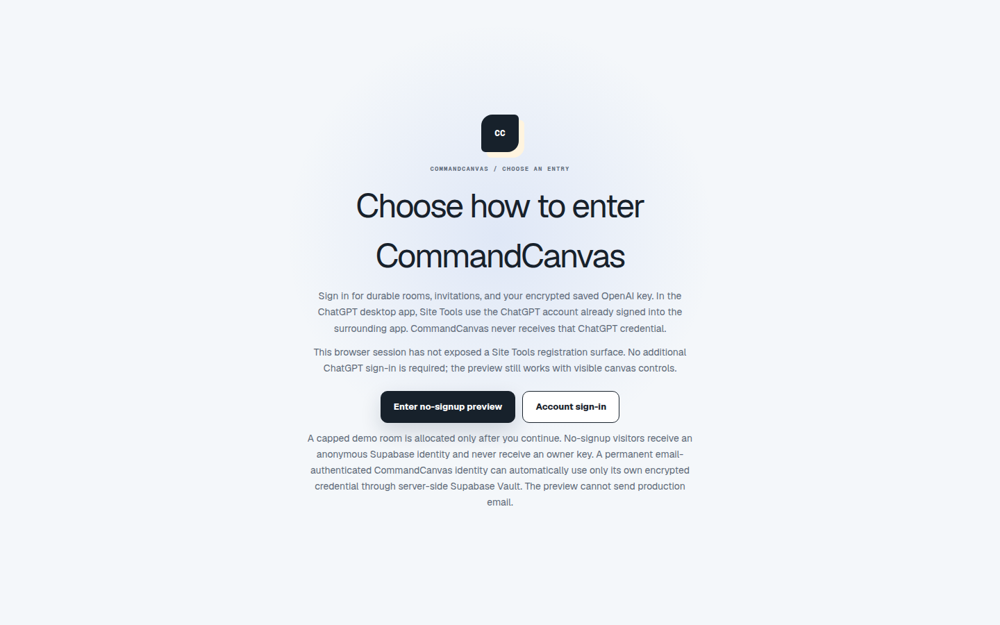
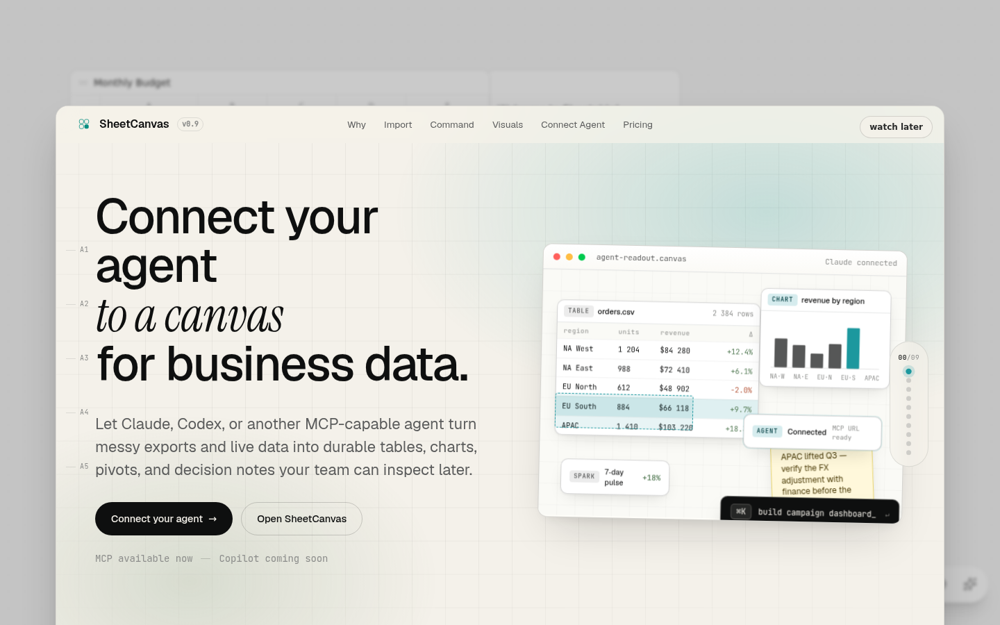
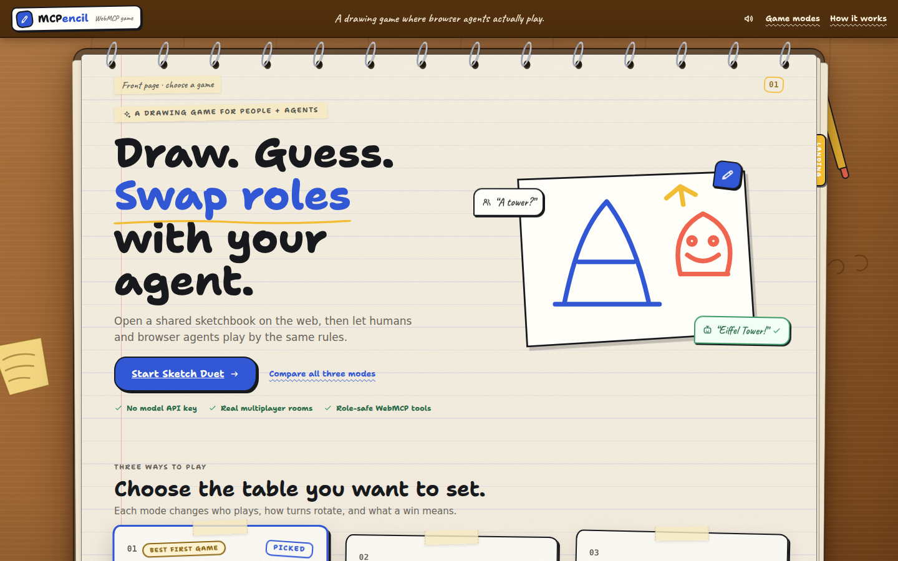
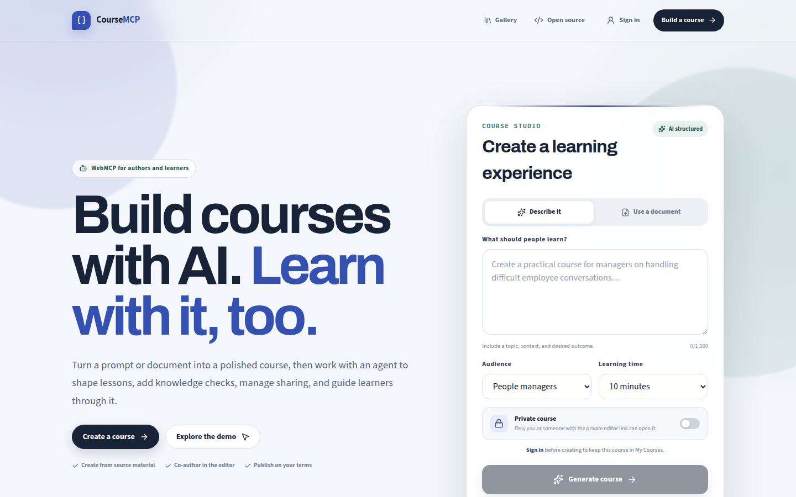
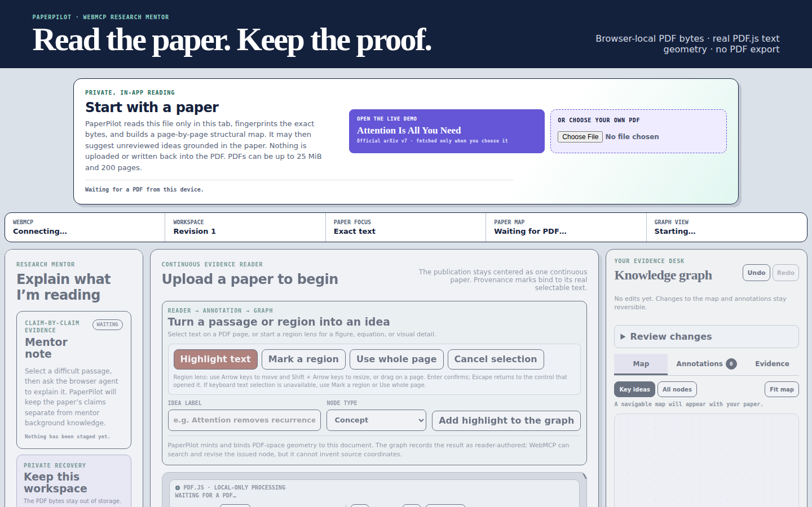
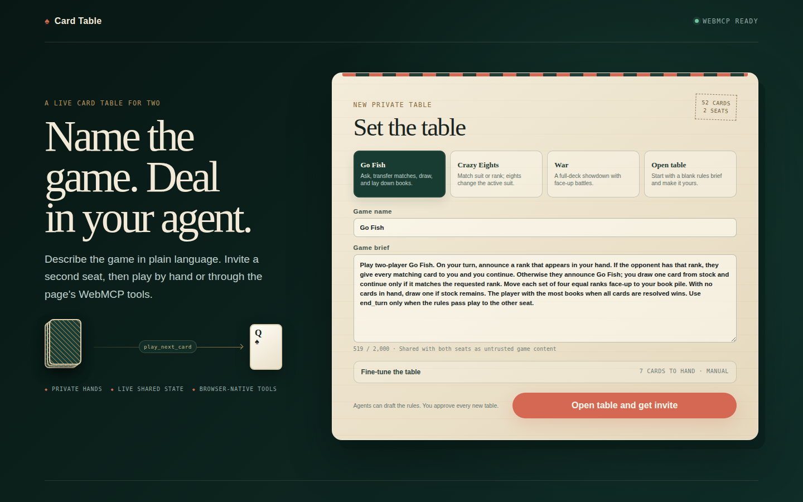
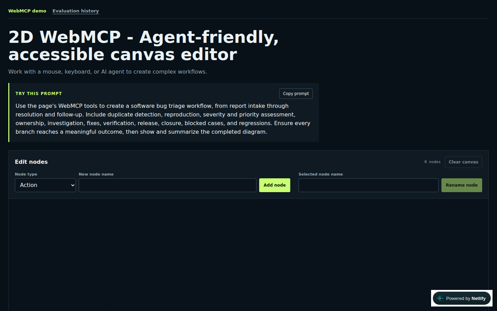
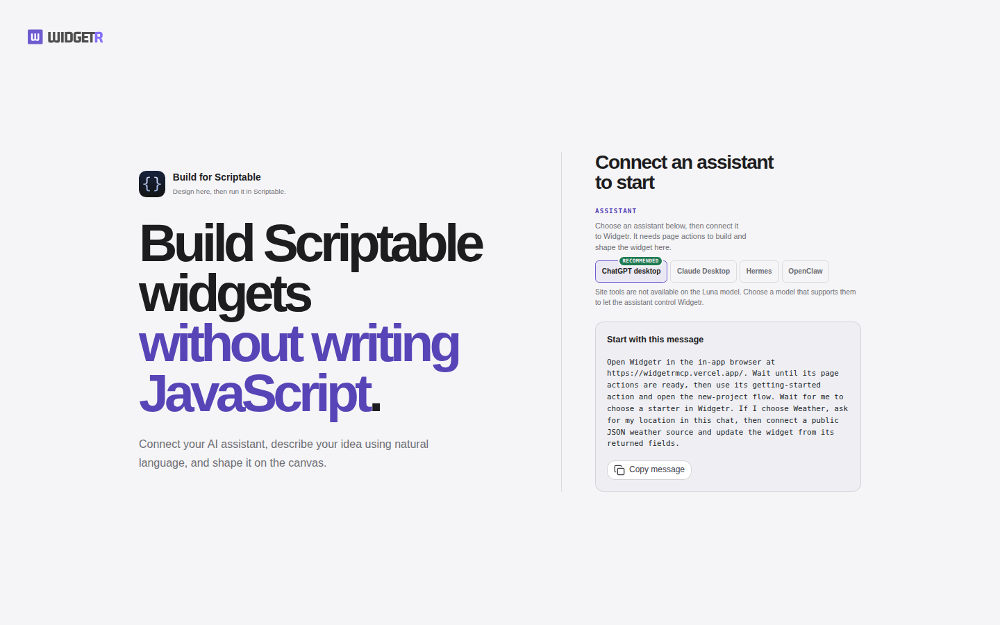
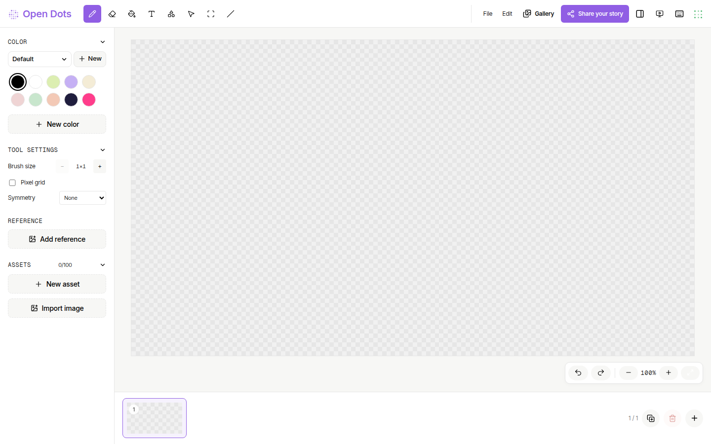
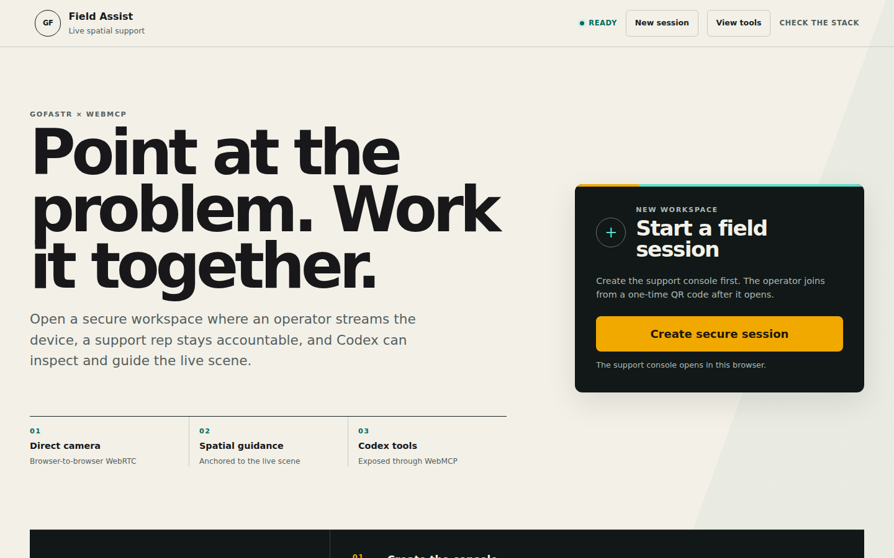

# SpaceScale's strongest WebMCP wedge is the live classroom, not the generic canvas

## Snapshot and evidence boundary

**Snapshot:** September 3, 2026
**Current exact-match count:** **47 other public GitHub repositories**

This scan answers a narrow, reproducible question: which public GitHub repositories currently contain a file named `devpost-submission.md` whose indexed contents mention `webmcp`?

The exact GitHub code-search query was:

```text
webmcp filename:devpost-submission.md
```

GitHub reported `total_count: 47`; the same 47 results reduced to 47 unique repositories. SpaceScale was not included in that indexed result, so the number represents other repositories. This is an indexed-code count, not a count of official Devpost entries. It can miss private repositories, differently named briefs, unindexed commits, briefs that do not contain the literal term, and projects that exist only on Devpost.

The index changed during the review: an earlier run returned 49 repositories. Three Webmax briefs disappeared from current results and `balsimpson/widgetr` appeared, producing the current total of 47. Commit-pinned brief links below preserve the evidence used for this snapshot.

Only the public submission briefs were used. Features, tests, deployments, readiness, and limitations are **author claims unless explicitly described as analysis**; competitor source code and live applications were not audited. Eighteen briefs received a dedicated one-agent review. The remaining 29 were read directly under the same brief-only evidence rule after the collaboration system reached its agent-thread limit.


## Cross-source deduplicated universe

The GitHub query is only one discovery channel. A second pass searched public Devpost project pages, YouTube, Reddit, the OpenAI developer forum, DEV Community, Hashnode, and general web results. The official [Devpost project gallery](https://webmcp.devpost.com/project-gallery) was still unpublished at the snapshot time, so there is no public authoritative list to count or reconcile against.

| Discovery source | Raw unique results reviewed | Excluded as non-project content | Cross-source duplicates removed | Net-new project identities |
| --- | ---: | ---: | ---: | ---: |
| GitHub briefs matching the exact query | 47 | 0 | 0 | 47 |
| Public Devpost pages explicitly marked "Submitted to The WebMCP Challenge" | 16 | 0 | 1 (2D WebMCP) | 15 |
| Unique YouTube results across five challenge/demo queries | 58 | 15 tutorials, announcements, or build streams | 1 (WebMCP-QCG) | 42 |
| Public forum posts explicitly calling the project a submission | 1 | 0 | 0 | 1 |
| **Deduplicated public lower bound, excluding SpaceScale** |  |  |  | **105** |

Including SpaceScale, the scan found **106 distinct public project identities** connected to the challenge. This is not an official submission count. The defensible interpretation is:

- **16 are Devpost-confirmed public challenge pages** found through search, including one already represented in the GitHub set.
- **47 have public, indexed submission briefs**, but some briefs may still be drafts or may never have been submitted on Devpost.
- **43 have project-specific YouTube evidence** tied to the challenge; one is already represented in the GitHub set, leaving 42 net-new candidates.
- **AgentPress is a forum-only claimed submission** in the material found.

The deduplication key was the strongest available identity in this order: canonical repository URL, Devpost project slug, live application URL, an explicit cross-link, then normalized project title plus creator/channel. Exact URL and explicit-cross-link matches are high confidence. Title-only YouTube candidates are medium confidence because a renamed project could be hiding an overlap. No exact collision was found beyond 2D WebMCP and WebMCP-QCG; ambiguous entries were retained once and are called candidates rather than confirmed submissions.

This total is volatile. The challenge was still accepting entries during the scan, search indexes lag, YouTube titles are inconsistent, and the official Discord is not publicly indexable. The official [OpenAI challenge page](https://openai.com/webmcp-challenge/) confirms that a valid entry needs a description, working deployed app, public code repository, and demo video, but public discovery of any one artifact does not prove that all submission requirements were completed.

## Executive take

SpaceScale is competitive, but “an AI canvas” is not a defensible headline by itself. CommandCanvas makes the closest broad claim: a shared semantic spatial workspace with sketches, AI-produced artifacts, receipts, and human-controlled outbound actions. Several other submissions also make strong individual claims around visual editing, permissions, approval gates, provenance, or education.

SpaceScale's more defensible combination is narrower and more memorable:

> **A realtime visual classroom where AI understands selected student handwriting, responds inside the shared canvas, and can act only with the permissions of the participant who invited it.**

No reviewed brief states that same full combination. SpaceScale should therefore demonstrate one compact learning loop instead of leading with its breadth of fifteen tools and 27 modes:

1. A student writes a quadratic and draws the wrong parabola.
2. The authorizing participant selects the work and asks the browser agent to inspect it.
3. The agent adds a visibly AI-authored, source-linked correction asking the student to plot `(-4, -2)`.
4. A second participant sees the result arrive in real time.
5. A viewer's agent attempts the same write and is denied by the server.
6. The authorized contribution is undone, then a shared lesson video is added.

That sequence proves the three parts competitors most often separate: visual understanding, participant-scoped authority, and realtime pedagogical collaboration.

## Closest competitive set

The overlap labels below are analytical judgments based on each project's stated product job, not scores from implementation testing.

| Project | Overlap | What its brief claims well | SpaceScale's opening |
| --- | --- | --- | --- |
| [CommandCanvas](https://github.com/romiteld/commandcanvas/blob/ec48964cce011f40619302aba6a80eeee8b86112/docs/devpost-submission.md) | **Direct** | Semantic spatial workspace, rough-sketch preservation, structured agent artifacts, receipts, voice/vision/gesture input, and a human-only send boundary. | Own the education-specific outcome: diagnosing a learner's visible misconception in a live multi-participant classroom, with author-scoped server authorization. |
| [SheetCanvas](https://devpost.com/software/sheetcanvas) | **Direct** | Persistent canvas for human-agent data analysis, 26 state-aware tools, one shared action path, activity history, visibility, and rewind. | SpaceScale must own visual teaching rather than generic canvas collaboration: handwriting interpretation, learner misconception correction, and classroom roles. |
| [MCPencil](https://devpost.com/software/mcpencil) | **Direct interaction benchmark** | Realtime rooms where people and browser agents draw and visually interpret sketches under the same validated protocol. | Distinguish purposeful pedagogy and permission inheritance from a game, while matching MCPencil's clarity and immediacy as a human-agent visual experience. |
| [CourseMCP](https://github.com/onEnterFrame/coursemcp/blob/5539dbe0064a2ce9d12cd66afd622274586db393/docs/devpost-submission.md) | **High adjacency** | A broad, permission-aware course lifecycle covering course creation, lessons, visuals, quizzes, progress, accounts, and sharing. | Show learning in progress rather than course production: handwriting, diagram correction, teacher/student coexistence, and synchronous canvas feedback. |
| [PaperPilot](https://github.com/patrickjcraig/PaperPilot/blob/b53ef7c984d00d0d01b403ab04da252042d01200/devpost-submission.md) | **High adjacency** | Exact PDF anchors, source-linked explanations, reversible graph and annotation changes, and human Save/Discard. | Demonstrate original student work and live peer/teacher collaboration rather than a research-PDF workflow. |
| [Card Table](https://github.com/zac/webmcp-card-table/blob/97c2a894116d5839f5a0ad7c925dabbeae68c074/devpost-submission.md) | **Architecture benchmark** | Realtime two-seat collaboration, private seat projections, server-enforced ownership and revisions, dynamic tools, WebSockets, replay, and approval. | Apply the same trust clarity to a higher-value classroom outcome and show that an agent inherits the inviter's actual classroom role. |
| [2D WebMCP Demo](https://github.com/AccessLint/2D-webmcp-demo/blob/d13dcf4589280c6fc3e34ebb57cfb5174ad63495/devpost-submission.md) | **Visual benchmark** | Accessible diagram inspection/editing, deterministic before/after receipts, focus/reveal handoff, and undo. | Add learning-specific reasoning, source-linked AI feedback, multi-user persistence, video, and role-bound writes. |
| [Widgetr](https://github.com/balsimpson/widgetr/blob/ccb0e9d2cf58a854c368f54320f368b6796c0112/devpost-submission.md) | **Visual benchmark** | Contextual tools that follow selection, revision-checked edits, aligned visual preview/history/export, and local-first undo/redo. | Show AI interpreting freeform handwriting and collaborating across people, rather than changing a structured single-user editor. |
| [Open Dots](https://github.com/MichaelHo02/open-dots/blob/1b87945dfa6f04b4afc636eb479396bc87f64b6e/devpost-submission.md) | **Creative adjacency** | Inspectable, iterative pixel-art and picture-book creation through structured art, story, palette, page, paint, and stamp tools. | Focus on formative feedback, permissions, and live classroom participation rather than browser-local content creation. |
| [Field Assist](https://github.com/DonaldMurillo/field-assist-webmcp/blob/302fa0f0108f25ce9f2bc8e967f102d56cdbe85e/devpost-submission.md) | **Visual collaboration adjacency** | A two-device session in which live phone video, object tracking, authenticated tools, and human confirmation support physical guidance. | SpaceScale's visual evidence is persistent, editable learning work with shared history, attribution, and undo. |


## Screenshots of the strongest competitors

The [complete 105-project demo-screen gallery](webmcp-competitor-gallery.md) includes one validated public screen for every deduplicated competitor identity, with evidence type and fallback labeling. The ten screens below are the highest-priority visual comparison set.

These captures show the public live product at a 1440 x 900 desktop viewport on September 3, 2026. They are visual evidence of the landing or judge-entry surface, not an implementation audit.

### CommandCanvas

Closest broad canvas competitor: a no-signup judge entry into a spatial human-agent workspace.



### SheetCanvas

Closest persistent human-agent canvas for a different domain: collaborative data analysis.



### MCPencil

Strongest immediately legible realtime human-agent drawing experience.



### CourseMCP

Closest education-native competitor, focused on creating and consuming courses.



### PaperPilot

Closest source-grounded learning and visual-annotation competitor.



### Card Table

Closest server-authoritative realtime roles and permissions benchmark.



### 2D WebMCP

Closest accessible diagram-inspection and reversible-edit benchmark.



### Widgetr

Closest selection-aware visual-editor benchmark.



### Open Dots

Closest playful visual-creation and child-friendly adjacency.



### Field Assist

Closest realtime video-guidance and authenticated-tool adjacency.



### Feature-claim comparison

`Yes` means the brief explicitly makes the claim. `Partial` means the brief describes a nearby capability. `Not central` means the capability was not a central claim in the brief; it does not prove the feature is absent from the product.

| Project | Realtime multi-person state | Handwriting or freeform sketch | Feedback tied to visible work | Role-scoped agent writes | Education-native | Shared video | Approval, receipt, or revision proof |
| --- | --- | --- | --- | --- | --- | --- | --- |
| **SpaceScale** | Yes | Yes | Yes | Yes | Yes | Yes | Yes: server acknowledgement, preview gates, attribution, undo |
| CommandCanvas | Partial | Yes | Partial | Not central | Not central | Partial: vision/voice | Yes: receipts and human send |
| SheetCanvas | Partial: shared human-agent state | Partial: visual data canvas | Partial | Partial: state-aware tool gating | Not central | Not central | Yes: activity trail and rewind |
| MCPencil | Yes | Yes | Yes: draw-and-guess | Partial: shared validated protocol | Not central | Not central | Yes: authoritative rooms and replay |
| CourseMCP | Partial: accounts/sharing | Not central | Partial | Yes | Yes | Not central | Not central |
| PaperPilot | Not central | Partial: visual PDF regions | Yes | Partial: human Save/Discard | Partial: research learning | Not central | Yes |
| Card Table | Yes | Not central | Not central | Yes | Not central | Not central | Yes |
| 2D WebMCP Demo | Not central | Yes: diagrams | Partial | Not central | Not central | Not central | Yes |
| Widgetr | Not central | Partial: visual editor | Partial | Partial: bounded revision writes | Not central | Not central | Yes |
| Field Assist | Yes: two devices | Partial: visual scene | Yes: scene guidance | Yes | Not central | Yes: live phone feed | Yes |

## Full public-brief inventory

The inventory is alphabetical. “Relevance” describes the competitive lesson for SpaceScale, not the quality of the submission.

| # | Repository | Product job stated in the brief | Claimed WebMCP differentiator | Relevance to SpaceScale |
| ---: | --- | --- | --- | --- |
| 1 | [3ssiri/RepoPulse](https://github.com/3ssiri/RepoPulse/blob/a0c3d7d7c115a76e9955d28e3b3ed8668dd8c6f8/docs/devpost-submission.md) | Repository-health workspace for developers preparing public repositories. | Four read-only tools share the dashboard's current report state with the agent. | Evidence and shared-state pattern; low product overlap. |
| 2 | [Abbas-Dev-786/change-frame](https://github.com/Abbas-Dev-786/change-frame/blob/dca0b9a27dd546b85cd8cf82b776fbd44e4c27eb/devpost-submission.md) | Construction decision room for alternatives, simulation, and change orders. | Phase-gated tools let agents create alternatives while humans retain selection, rejection, and approval. | Strong human-authority benchmark. |
| 3 | [AccessLint/2D-webmcp-demo](https://github.com/AccessLint/2D-webmcp-demo/blob/d13dcf4589280c6fc3e34ebb57cfb5174ad63495/devpost-submission.md) | Accessible 2D workflow editor for blind and screen-reader users. | Structured diagram edits return deterministic before/after receipts and support focus, reveal, and undo. | Medium visual overlap; trust and accessibility benchmark. |
| 4 | [AdityaP9116/BuildReady](https://github.com/AdityaP9116/BuildReady/blob/cc6f763b2e7fffc31e0f5834c6cdcda77f8b3d1a/devpost-submission.md) | CNC manufacturing-readiness workspace. | State-aware design inspection, bounded correction previews, supplier comparison, and engineer approval. | Approval and evidence-chain benchmark. |
| 5 | [Anionix/verifiable-offline-webmcp-agent-spec](https://github.com/Anionix/verifiable-offline-webmcp-agent-spec/blob/8d89609d3b582b5e076555a5635cb2e6f83175f7/devpost-submission.md) | Offline-safe hotel booking retry proof. | Stable booking identity, read-before-retry, local uniqueness, and cryptographic event history prevent duplicate reservations. | Idempotency benchmark; low product overlap. |
| 6 | [AnkanMisra/prodpermit](https://github.com/AnkanMisra/prodpermit/blob/87d72ee851f9bf53c8d78264cd6fd5b67d389da0/devpost-submission.md) | Incident-response workspace for investigating checkout failure and staging recovery. | An execute tool appears only after an immutable plan is approved, then disappears after use. | Excellent dynamic least-authority benchmark. |
| 7 | [Avinash1286/benchpilot](https://github.com/Avinash1286/benchpilot/blob/24880aab1886ba5c8996e6b76b0dd4084be2faf1/docs/devpost-submission.md) | Low-voltage electronics troubleshooting canvas. | A live case supports safe-step proposals, human measurements, hypotheses, plans, provenance, review, and undo. | Collaborative diagnostic-loop benchmark. |
| 8 | [Daisuke134/life-manager](https://github.com/Daisuke134/life-manager/blob/659deab7229e05b66ff445a6fba05c4df5229497/devpost-submission.md) | Persistent opportunity and bounded-work manager. | Provider-neutral workrooms use idempotency/effect fences and treat only verified receipts as money truth. | Persistence and side-effect benchmark. |
| 9 | [DonaldMurillo/field-assist-webmcp](https://github.com/DonaldMurillo/field-assist-webmcp/blob/302fa0f0108f25ce9f2bc8e967f102d56cdbe85e/devpost-submission.md) | Remote physical guidance using a phone camera and support operator/agent. | Twenty-five authenticated tools combine a two-device session, P2P video, object tracking, verified controls, and human confirmation. | Medium visual and realtime adjacency. |
| 10 | [JacobLinCool/PaperSpace](https://github.com/JacobLinCool/PaperSpace/blob/6ee2e226cb1f60453311db71397e1fe12312d823/devpost-submission.md) | Local-first spatial desk for reading, arranging, and presenting research PDFs. | Nine tools create reversible spatial evidence sequences from original PDF regions. | Medium canvas/research adjacency. |
| 11 | [JamesWirths/threadline](https://github.com/JamesWirths/threadline/blob/1be81465f25b7dcb7545c8d244eec11bc402860e/docs/devpost-submission.md) | Provenance-preserving evidence debugger for turning claims into argument graphs. | Agents stage sources, claims, relationships, groups, and verdicts while humans accept them; uncertainty and lineage remain visible. | Source-linkage and review benchmark. |
| 12 | [Joe-Simo/paradox-webmcp](https://github.com/Joe-Simo/paradox-webmcp/blob/4c43ff6d08b044fdbcf7b9178fac553f424ed448/devpost-submission.md) | Deterministic lab for finding human-agent race conditions. | Dynamic tools model, minimize, replay, guard, and verify problematic interleavings. | Concurrency and stale-state benchmark. |
| 13 | [KkOma-value/persistent-web-skills-runtime](https://github.com/KkOma-value/persistent-web-skills-runtime/blob/a100228f1256dfc5a727e2126214f7babd6a9a5f/devpost-submission.md) | Browser runtime that learns successful workflows as reusable skills. | Native WebMCP is preferred, with cached semantic skills, page fingerprints, and targeted repair after changes. | Runtime/tooling category; low product overlap. |
| 14 | [Kotakageyama/webMCP](https://github.com/Kotakageyama/webMCP/blob/321cf67402f2ac1fa4f2f92926a71ddfcd5a84fb/docs/devpost-submission.md) | Ecommerce operations dashboard that adapts to returns, address changes, and cancellations. | The UI and tool catalog both contract to state-relevant capabilities with consequence previews and approval. | Strong contextual-capability benchmark. |
| 15 | [MichaelHo02/open-dots](https://github.com/MichaelHo02/open-dots/blob/1b87945dfa6f04b4afc636eb479396bc87f64b6e/devpost-submission.md) | Browser pixel-art picture-book editor for children and families. | Four read and ten write tools expose an inspectable, iterative art/story/palette/page workflow. | Medium visual/education adjacency. |
| 16 | [Nifemi0/scholarship-scout](https://github.com/Nifemi0/scholarship-scout/blob/f424f81d914b92ebc2921be9c64a5cba09330224/devpost-submission.md) | Source-transparent scholarship search and planning workspace. | Six tools expose deterministic match, mismatch, and unknown eligibility states with official sources and freshness. | Education-adjacent evidence benchmark. |
| 17 | [SeCuReDmE-main-dev/webmcp-hackathon-2026](https://github.com/SeCuReDmE-main-dev/webmcp-hackathon-2026/blob/dbd77d249b33c69036fd46d34893929079f68756/devpost-submission.md) | Quantum call gate for deciding reuse, stop, recompilation, local simulation, or external readiness. | Progressive tools combine consent, evidence-first cost/authorization checks, and bounded WebAssembly simulation. | Consent and progressive-disclosure benchmark. |
| 18 | [SebastianBoehler/webmcp-structural-evolution](https://github.com/SebastianBoehler/webmcp-structural-evolution/blob/cd83730b744f74f22dc8392529747a5b9a1486b2/devpost-submission.md) | Browser 3D physical assembly and topology workbench. | Six tools produce visible topology evidence, protect volumes, stage imports, and keep promotion human-controlled. | Medium visual-workbench adjacency. |
| 19 | [Trueuss/baw-webmcp](https://github.com/Trueuss/baw-webmcp/blob/34b5e6705459dc3d40c14eebf58ad238740ea8a7/devpost-submission.md) | Browser-local wardrobe and outfit stylist. | Ten tools manage garments and outfits while input schemas react to the current wardrobe. | Dynamic-schema example; low product overlap. |
| 20 | [VitalJeevanjot/time-and-dime](https://github.com/VitalJeevanjot/time-and-dime/blob/1a89356f7adda218277db4ef961b0dcb13382c51/devpost-submission.md) | Local-first timed scenario calculator displayed as a graph. | Agents create, calculate, clone, inspect, and compare deterministic virtual schedules. | Graph-based decision-workbench pattern. |
| 21 | [ajaknumber4/action-check-webmcp](https://github.com/ajaknumber4/action-check-webmcp/blob/ea40df68f81319d7f85f2873a99a4a2dfe3e0e98/devpost-submission.md) | External harness for verifying WebMCP side effects, retries, and idempotency. | It treats a tool response as an untrusted claim, injects lost acknowledgements/retries, and independently observes state. | Highest-value verification benchmark for SpaceScale's commit claims. |
| 22 | [balsimpson/widgetr](https://github.com/balsimpson/widgetr/blob/ccb0e9d2cf58a854c368f54320f368b6796c0112/devpost-submission.md) | Visual local-first builder for Scriptable widgets. | Selection-aware tools, revision-checked scoped edits, aligned previews/history, and deterministic export share one canonical state. | Medium visual-editor adjacency. |
| 23 | [bpais88/Parley](https://github.com/bpais88/Parley/blob/ac83ce0bd7ee8e16d21082c59161007ab64a0426/devpost-submission.md) | Direct hotel booking negotiation between a guest agent and deterministic hotel policy. | Guest and onboarding tools support offers/counters/holds while acceptance and payment remain human-only. | Human-control and economic-outcome benchmark. |
| 24 | [calc2te/northstar-webmcp-challenge](https://github.com/calc2te/northstar-webmcp-challenge/blob/572c1d415baa0982bcd20359ce27eeba351435e6/docs/devpost-submission.md) | Visual improvement-decision workspace for software and RAG troubleshooting. | Tools connect exact source evidence, hypotheses, decisions, and revision state so human constraints change the agent's next recommendation. | Medium visual decision-workspace adjacency. |
| 25 | [chvignesh07/focus-contract-studio](https://github.com/chvignesh07/focus-contract-studio/blob/835cb812faf8ec043486b2e0ebec7d7784236dbb/devpost-submission.md) | Accessibility/design-system review and repair of focus behavior. | Proposal, human-only approval, exact digest/revision binding, application, and verification are separate steps. | Approval-fingerprint benchmark. |
| 26 | [dorakingx/ruleloom](https://github.com/dorakingx/ruleloom/blob/54f04b11d26b608ae7190412230b78a4be1d82ad/devpost-submission.md) | Human-governed tabletop game design workspace. | A one-use apply capability appears only after a version-bound proposal receives human approval. | Strong ephemeral-capability benchmark. |
| 27 | [eliadco5/NavWebmcp](https://github.com/eliadco5/NavWebmcp/blob/c2d5fe7f5852e81af7c913bd4f50078166696e96/docs/devpost-submission.md) | Progressive-disclosure and RBAC protocol layer, demonstrated with hospitality operations. | Eight navigation/meta tools expose a larger catalog and composite operations across WebMCP and MCP HTTP. | Tool-catalog/token-efficiency benchmark. |
| 28 | [haakanergun/gridbrief-tr](https://github.com/haakanergun/gridbrief-tr/blob/c6b4e94a4f1a19216e851aee642a9829a0c5cf9f/work/devpost-submission.md) | Turkish electricity-market risk and shift brief workspace. | Six tools preserve provenance, freshness, mode labels, and source coverage while excluding trade execution. | Evidence-boundary benchmark. |
| 29 | [ibrinzila/signalui-interface-on-demand](https://github.com/ibrinzila/signalui-interface-on-demand/blob/46c57a492ab8cd1ef744ad0ce77e7ce9d9541dcb/docs/devpost-submission.md) | Governed adaptive anomaly-review interface for an energy-reading reference vertical. | Role- and state-dependent tools share a command bus with the UI; writes use policy, version, approval fingerprint, and append-only receipts. | Directly relevant role/authority benchmark. |
| 30 | [jongan69/RoarCAD](https://github.com/jongan69/RoarCAD/blob/57770d8c18f0bbee624f9ed453b4d036bd0b1e42/devpost-submission.md) | Human-governed PCB design and manufacturing-readiness workspace. | Structured board graphs, compilation, checkpoints, provenance, preview, validation, and human apply/fabrication gates. | Medium visual engineering-workbench adjacency. |
| 31 | [kjs844-art/offerproof-webmcp](https://github.com/kjs844-art/offerproof-webmcp/blob/6ed442e753a1c0bc776578dec7647154a4482e6d/devpost-submission.md) | Job-offer evidence and verification-plan workspace. | Exact excerpts, consent/version guards, official resources, and receipts avoid unsupported fraud verdicts. | Source-linked caution and receipt benchmark. |
| 32 | [manikv12/OpenAssist](https://github.com/manikv12/OpenAssist/blob/0929946584925bc3278be9973a0d167543ec9d1c/docs/webmcp-devpost-submission.md) | Daily workspace across mail, tasks, calendar, notes, memory, and supplies. | Twenty-nine tools use signed, short-lived previews for writes and display verified outcomes. | Breadth and cross-tool authorization benchmark. |
| 33 | [mathiasonea/relaybench](https://github.com/mathiasonea/relaybench/blob/205aafb83b8c057407abb2dadd7b650db76adace/docs/devpost-submission.md) | Shared diagnostic workspace where an agent requests a physical observation from a nearby person. | A tool call can pause for asynchronous human evidence and resume with the observation as structured output. | Strong human-in-the-loop interaction pattern. |
| 34 | [meabs/ResilienceForge](https://github.com/meabs/ResilienceForge/blob/f92dbdd3ac36a4394d92c4e6754522bda2d54114/devpost-submission.md) | Architecture-operations bench for simulation, remediation, and stale-state recovery. | A large tool catalog uses expected versions, visible topology/gauges, pins, event recording, and concurrency recovery. | Stale-state and shared-view benchmark. |
| 35 | [misterkidult/ai-nomos](https://github.com/misterkidult/ai-nomos/blob/7d81cdbe0a516c2464815dcd482bc17b8715661b/context/devpost-submission.md) | Crowdsourced multilingual AI terminology dictionary built from articles. | Agents extract terms under quote locks, submissions remain pending, and humans confirm accumulated sightings. | Attribution and review benchmark. |
| 36 | [onEnterFrame/coursemcp](https://github.com/onEnterFrame/coursemcp/blob/5539dbe0064a2ce9d12cd66afd622274586db393/docs/devpost-submission.md) | End-to-end course creation, learning, progress, and sharing product. | Thirty-three tools cover creator, gallery, account, course, editor, and learner workflows with permissions. | High education adjacency; breadth benchmark. |
| 37 | [onerandomd3v/Web-MCP-Vision-Tool](https://github.com/onerandomd3v/Web-MCP-Vision-Tool/blob/04d7db538449496682d00422ea0eb5e65d94bc29/devpost-submission.md) | Espresso product shop exposing structured catalog and bounded image payloads to a multimodal agent. | Twenty tools separate structured product data from two-to-three-image visual comparison payloads. | Multimodal payload-boundary benchmark. |
| 38 | [ostheimer/webmcp-simulator](https://github.com/ostheimer/webmcp-simulator/blob/9435f301fbd7e4c2656ddab16706b6a17214a915/docs/devpost-submission.md) | Simulator that lets site owners experience a possible WebMCP implementation. | Five tools act visibly on a fictional service site and generate an implementation pack without modifying the original site. | Tooling/inspiration category; low product overlap. |
| 39 | [patrickjcraig/PaperPilot](https://github.com/patrickjcraig/PaperPilot/blob/b53ef7c984d00d0d01b403ab04da252042d01200/devpost-submission.md) | Research mentor for real scientific PDFs. | Six tools connect explanations, graphs, and annotations to exact source anchors with reversible, human-reviewed edits. | High learning/evidence adjacency. |
| 40 | [romiteld/commandcanvas](https://github.com/romiteld/commandcanvas/blob/ec48964cce011f40619302aba6a80eeee8b86112/docs/devpost-submission.md) | Semantic spatial workspace for meetings, design, and research. | Twelve tools preserve rough sketches beside structured agent artifacts and add receipts, multimodal controls, and a human-only send step. | Closest direct product competitor. |
| 41 | [samueltate/adaptive-webmcp](https://github.com/samueltate/adaptive-webmcp/blob/1d04115062b9dd6bc3f7decd854dbdd249cea7b4/devpost-submission.md) | Agent-adapted public-service sites for readability, navigation, task focus, and mobile preview. | Safe page-owned controls inspect and apply accessibility profiles across DMV, hospital, and county examples. | Accessibility and adaptive-UI benchmark. |
| 42 | [sin4ch/MetaEdit](https://github.com/sin4ch/MetaEdit/blob/88ef15431c5b5b954f7b8dbb2be12dd01321e3c8/devpost-submission.md) | Collaborative website editing from inside the website itself. | Human annotation at a DOM target leads to an attributed agent patch, collaborator review, and owner publication. | Strong annotation-to-agent-to-approval pattern. |
| 43 | [stevensuna/floodstudio](https://github.com/stevensuna/floodstudio/blob/fdfdd2e75333dce75a1a180ef34896455bb30b5c/docs/hackathon-build/devpost-submission.md) | Synthetic flood-adaptation planning canvas. | Four tools share explicit constraints and deterministic zone-flow scenarios while a human selects the plan. | Medium visual planning-canvas adjacency. |
| 44 | [tomishninja/Schedule-Rank-WebMCP-Adapter](https://github.com/tomishninja/Schedule-Rank-WebMCP-Adapter/blob/7fd9f7f88ad737dd9c16db38c00ad8143a1e5828/devpost-submission.md) | Adapter that normalizes contractor scheduling systems and ranks availability confidence. | Three provider demos expose service lookup, time finding, and booking with explicit evidence tiers. | Evidence vocabulary benchmark; low product overlap. |
| 45 | [wordlift/ai-audit-webmcp](https://github.com/wordlift/ai-audit-webmcp/blob/fd6ab21a1148726c8687bdf80463549c540efa6b/devpost-submission.md) | Website context engine that maps entities, expected actions, interfaces, and invocation evidence. | Six generic audit/refinement tools separate declarations from proven calls and compile human-refined service maps with provenance. | Strong evidence/readiness benchmark. |
| 46 | [zac/webmcp-card-table](https://github.com/zac/webmcp-card-table/blob/97c2a894116d5839f5a0ad7c925dabbeae68c074/devpost-submission.md) | Realtime two-player table for prompt-defined 52-card games. | Contract-specific tools share the server action path with the UI; seat projections, revisions, invitations, WebSockets, and replay enforce private roles. | Closest architecture/permission analogue. |
| 47 | [zaeem-rafiq/nwa-growth-signal-webmcp](https://github.com/zaeem-rafiq/nwa-growth-signal-webmcp/blob/10d26de04e634222a3245207146ce5184e75b04e/devpost-submission.md) | Source-backed municipal planning evidence desk. | Four tools preserve dated filing-level evidence and visible receipts while staging—but never publishing—a human-reviewed brief. | Source integrity and bounded-write benchmark. |


## Cross-source supporting inventory

The 47 GitHub briefs above remain the detailed brief-only competitor set. This section records the net-new identities used in the cross-source count. Names and links establish discoverability; they do not imply that source code, deployment, or eligibility was audited.

### Devpost-confirmed pages not in the GitHub brief set

The separate public page for 2D WebMCP was also found, but it is already represented by the AccessLint repository above and was deduplicated.

1. [SheetCanvas](https://devpost.com/software/sheetcanvas)
2. [VT](https://devpost.com/software/vt-y4n8u0)
3. [Gallery 402](https://devpost.com/software/gallery-402)
4. [MIRROR//LOOP](https://devpost.com/software/mirror-loop)
5. [Mike the Cat's Moonlight Run](https://devpost.com/software/mike-s-moonlight-run)
6. [Dependency War Room](https://devpost.com/software/dependency-war-room)
7. [Teachback](https://devpost.com/software/teachback-de9cr3)
8. [Redini-Atelier](https://devpost.com/software/redini-atelier)
9. [MCPencil](https://devpost.com/software/mcpencil)
10. [tobidas](https://devpost.com/software/tobidas)
11. [Taste Gate](https://devpost.com/software/taste-gate)
12. [The Coop](https://devpost.com/software/the-coop)
13. [AI Lovey-Dovey Kyun-Kyun!](https://devpost.com/software/ai-lovey-dovey-kyun-kyun-our-first-mission-together)
14. [LedgerAgent AI](https://devpost.com/software/developers-xa3nw7)
15. [Interactive Star Lab](https://devpost.com/software/interactive-star-lab)

### Net-new project-specific YouTube candidates

Five query variants were checked: "WebMCP Challenge", "OpenAI WebMCP Challenge demo", "WebMCP Challenge submission", "WebMCP hackathon demo", and "WebMCP Challenge 2026". The union contained 58 unique videos. Fifteen general explainers, official talks, tutorials, or in-progress build streams were excluded. Of the 43 project-specific videos, WebMCP-QCG was linked to the already-counted SeCuReDmE-main-dev repository, so the following 42 are net new.

| # | Project-specific challenge video |
| ---: | --- |
| 1 | [AgentGate](https://www.youtube.com/watch?v=EmpHneJSSlw) |
| 2 | [Blickwinkel](https://www.youtube.com/watch?v=oaxNlDZ15DM) |
| 3 | [Brenych Studio Agent Interface](https://www.youtube.com/watch?v=1l0x9pEbJS4) |
| 4 | [ClaimReady](https://www.youtube.com/watch?v=gdCeoWgyegY) |
| 5 | [ClearRights Privacy](https://www.youtube.com/watch?v=jZI10DsSWyg) |
| 6 | [Conductor WebMCP](https://www.youtube.com/watch?v=_pNX7ZZ43YU) |
| 7 | [CoSpace](https://www.youtube.com/watch?v=1fUlMDDR7CY) |
| 8 | [Dazwischenfunken](https://www.youtube.com/watch?v=B3qbrK8W5Kw) |
| 9 | [DealTable](https://www.youtube.com/watch?v=-zPTvL9Deso) |
| 10 | [Front Desk](https://www.youtube.com/watch?v=07lGOuDaZAc) |
| 11 | [Duet](https://www.youtube.com/watch?v=-woEVj6zaS0) |
| 12 | [Forsyningsdata Danmark](https://www.youtube.com/watch?v=q0HNQk3voBw) |
| 13 | [GeoMart](https://www.youtube.com/watch?v=HKDsfzZTbLs) |
| 14 | [HomeWheel](https://www.youtube.com/watch?v=gga0UbnX4PY) |
| 15 | [Inkframe](https://www.youtube.com/watch?v=goNRyhAkRio) |
| 16 | [Know Before Yes](https://www.youtube.com/watch?v=muJlYADo1Zg) |
| 17 | [LAFRYHI AgentCut](https://www.youtube.com/watch?v=QGL906UeoYo) |
| 18 | [Lantern](https://www.youtube.com/watch?v=JPlWgPr49l8) |
| 19 | [NetSpectre](https://www.youtube.com/watch?v=U3N7XXOGOwk) |
| 20 | [NeXaCard WebMCP](https://www.youtube.com/watch?v=Xvjc0S39DGQ) |
| 21 | [Ninth Tool](https://www.youtube.com/watch?v=P8Sc6XnVJI8) |
| 22 | [Project Notebook](https://www.youtube.com/watch?v=d062EVrH0Cw) |
| 23 | [Alpix](https://www.youtube.com/watch?v=tTXIufDSL5w) |
| 24 | [Ops Co-pilot](https://www.youtube.com/watch?v=GxwUFkXc6oI) |
| 25 | [Pitch The AI](https://www.youtube.com/watch?v=RuVrJTvDSc4) |
| 26 | [Polkaswap](https://www.youtube.com/watch?v=S9xtCkkbbAE) |
| 27 | [Quorum](https://www.youtube.com/watch?v=x4eKV-wZWwU) |
| 28 | [ROVE](https://www.youtube.com/watch?v=BX28HKKD6wQ) |
| 29 | [Semantic City](https://www.youtube.com/watch?v=DnSRjhxaqMs) |
| 30 | [SeriesSafe](https://www.youtube.com/watch?v=tmLKKPgGdEc) |
| 31 | [SLOPBOT](https://www.youtube.com/watch?v=YXWwk4QnwzY) |
| 32 | [StagedOps](https://www.youtube.com/watch?v=oYLwhqedd-c) |
| 33 | [TBR](https://www.youtube.com/watch?v=7HRfz-xouaQ) |
| 34 | [The Between: Visiting Minds](https://www.youtube.com/watch?v=Got_uoo_l_Q) |
| 35 | [Versailles - The Thread of Time](https://www.youtube.com/watch?v=XsjfANUBmD8) |
| 36 | [VoiceGuard](https://www.youtube.com/watch?v=gs5DqTvrgfg) |
| 37 | [Voivent MV Studio](https://www.youtube.com/watch?v=iR75E2XbD5g) |
| 38 | [wcrew](https://www.youtube.com/watch?v=RvHgdvq_928) |
| 39 | [GFX Computer](https://www.youtube.com/watch?v=aG7UCVwQ3Fg) |
| 40 | [Dolly.dev](https://www.youtube.com/watch?v=VyHd8ql8RHY) |
| 41 | [Network triage demo](https://www.youtube.com/watch?v=oDsdra0lFtU) |
| 42 | [Woven](https://www.youtube.com/watch?v=kT62NyI2xno) |

### Forum-only claimed submission

- [AgentPress in the official r/codex challenge thread](https://www.reddit.com/r/codex/comments/1vybe0i/webmcp_challenge/) describes itself as an open-source, permission-aware WordPress submission. The same project was cross-posted to r/WebMCP_Developers and counted once.

## Patterns across the field

### 1. Human approval is common; inherited participant authority is more specific

ProdPermit, RuleLoom, Focus Contract Studio, ChangeFrame, SignalUI, Parley, MetaEdit, Card Table, and others all foreground human approval or constrained execution. SpaceScale should not present “human in the loop” alone as novel.

Its sharper claim is that the browser agent has **the same author identity and no more authority than the participant who invoked it**, across every write path, with authoritative server revalidation. The demo should make that distinction observable: identify the current role, show a successful authorized AI contribution, show a viewer denial, and show that another participant's object cannot be silently rewritten.

### 2. Receipts and revisions are becoming the trust language

Action Check, the 2D demo, SignalUI, Widgetr, Card Table, RuleLoom, Focus Contract Studio, and NWA Growth Signal describe receipts, expected revisions, state hashes, or independently observed effects. SpaceScale already claims durable acknowledgement, authoritative data, attribution, synchronization, and undo, but the proof is distributed across the experience.

The submission would be easier to trust if the demo and screenshots expose one compact activity record containing:

- the authorizing participant and role;
- the WebMCP action or semantic intent;
- the source object(s) selected;
- the server-acknowledged outcome or denial;
- the resulting object and undo availability.

This does not require turning the product into an audit console. One visible receipt is enough to make the permission story legible.

### 3. Visual workspaces are crowded; visual pedagogy is not

CommandCanvas, SheetCanvas, MCPencil, PaperSpace, Open Dots, the 2D demo, Widgetr, Structural Evolution, RoarCAD, FloodStudio, and PaperPilot all use a visual or spatial surface. SpaceScale should avoid generic claims such as “AI can see the canvas” without the learning consequence.

The quadratic example is strong because it contains a falsifiable pedagogical action. The agent does not merely describe an image; it connects the student's claimed roots to a concrete counterexample and places the correction beside the work where the class can respond.

### 4. Narrow judge paths are easier to remember than large catalogs

Many strong briefs reduce the product to four to eight tools and one visible loop. SpaceScale's fifteen tools and 27 modes demonstrate depth, but those numbers can blur the story. Keep them in the technical detail. The first minute should prove only:

```text
selected handwriting -> agent inspection -> source-linked correction -> realtime peer view
```

The second trust beat is:

```text
same request as viewer -> server denial -> authorized undo
```

Video can close the story as a shared lesson artifact rather than another feature tour.

### 5. Education has adjacent entrants, but no identical brief

CourseMCP owns breadth across the course lifecycle. PaperPilot emphasizes research evidence. Scholarship Scout emphasizes eligibility truth. Open Dots serves child-friendly creative work. None of the reviewed briefs combines live student handwriting, spatial error correction, realtime classroom state, source-linked AI authorship, participant-role inheritance, and shared lesson video.

That combination is SpaceScale's whitespace.

## Recommended positioning and submission changes

### Lead message

Use this consistently in the Devpost first paragraph, demo opening, repository hero, and spoken close:

> **SpaceScale is the realtime visual classroom where AI understands selected student handwriting, responds in the shared workspace, and acts only with the permissions of the participant who invited it.**

Supporting proof line:

> A student's wrong parabola becomes a source-linked AI correction that the class sees live, a viewer cannot forge, and the author can undo.

### Priority 0: make the current differentiators unmistakable

1. **Open on the wrong graph, not the homepage.** Show `x² + 7x + 10 = 0`, the incorrect roots `-3` and `-1`, and the student claim.
2. **Show selection as consent.** Keep the selected-only visual boundary visible before the agent inspects handwriting.
3. **Make AI authorship visible.** The correction should visibly say it was AI-assisted and name the authorizing participant.
4. **Show the exact mathematical correction.** Ask the learner to test `x = -4`, calculate `y = -2`, and plot `(-4, -2)`.
5. **Prove realtime state.** Keep a second participant visible when the feedback arrives.
6. **Prove authority at the server boundary.** Show a viewer tool call fail, not merely a disabled button.
7. **Undo the contribution.** This closes the trust loop in one gesture.
8. **End with video as collaboration.** Add or move a shared YouTube/Vimeo lesson card and show it synchronize.

### Priority 1: strengthen the proof surface

- Add or feature a compact AI activity/receipt view using data already available from the authoritative action path.
- Use one consistent label for AI-originated objects across the canvas, comments, screenshots, and demo narration.
- State the permission invariant in plain language next to the evidence: “The agent cannot choose its actor ID or role.”
- Prefer a three-role proof—owner, editor, viewer—if it fits the recording without weakening the main learning loop.
- Keep tool-count and mode-count language secondary to the problem outcome.

### Priority 2: longer-term competitive moves

- Turn AI feedback into a distinct classroom object with resolution state, learner response, and teacher acknowledgement.
- Add a replayable evidence trail for selected work, agent feedback, human revisions, and undo.
- Explore source-grounded lesson/PDF objects, but only after the handwriting-feedback loop is excellent; PaperPilot and CourseMCP already tell broader content-ingestion stories.
- Build an adversarial action test around lost acknowledgements, retries, stale versions, and role changes, borrowing the trust standard articulated by Action Check and Paradox.

## Competitive risks

| Risk | Why it matters | Mitigation |
| --- | --- | --- |
| CommandCanvas can sound like the same product at headline level. | “AI + shared spatial canvas” is no longer distinctive. | Make every headline education-specific and show the mathematical feedback loop immediately. |
| Approval-first entries may make SpaceScale's permission story look routine. | Judges may group all human-control claims together. | Demonstrate inherited participant identity, server revalidation, ownership rules, and viewer denial as one coherent invariant. |
| Evidence-first entries set a high bar for trust. | Source links and attribution alone may feel weaker than receipts or independent verification. | Expose the authoritative acknowledgement and undo state visibly; consider an action-check regression test. |
| CourseMCP can claim a broader education product. | Breadth is easy to communicate in a feature list. | Compete on the quality of the live teaching moment, not the size of the course-management surface. |
| A fifteen-tool demo can become a catalog tour. | Judges remember a story, not a schema inventory. | Demonstrate the smallest end-to-end loop and leave the remaining tools for judge testing. |

## Bottom line

The cross-source scan found 105 other public project identities tied to the challenge, while the 47 detailed public briefs show a crowded field around governed writes, visible agent actions, evidence, and specialized WebMCP workbenches. SpaceScale should not claim uniqueness for any one of those ingredients.

It can credibly claim a differentiated product-level combination: **realtime classroom collaboration, selected handwriting and sketch understanding, AI feedback attached to student work, participant-inherited permissions enforced on the durable write path, shared video, attribution, and undo**. The submission will be strongest when the quadratic correction proves that combination in under a minute.
