# WebMCP competitor demo-screen gallery

**Snapshot:** September 3, 2026
**Deduplicated competitors represented:** **105**
**Capture result:** **105 passed, 0 pending review**

This gallery is the visual companion to the [competitor analysis](webmcp-competitor-analysis.md). It covers every other public project identity in that snapshot: 47 GitHub-brief candidates, 15 net-new Devpost-confirmed projects, 42 net-new YouTube project candidates, and one forum-only claimed submission. The official Devpost gallery was not public during the scan, so this is a discovery lower bound rather than an official submission list.

| Evidence screen | Count | Meaning |
| --- | ---: | --- |
| Live app | 52 | First meaningful 1440 x 900 viewport from the published product URL. |
| YouTube demo frame | 46 | A nonzero timestamp from the public project demo on YouTube. |
| Project-owned screenshot | 1 | A screenshot published by the project when no live deployment was available. |
| Repository fallback | 5 | Repository page used because a public live/demo URL was absent or returned 404. |
| Forum/search fallback | 1 | Public discovery evidence only; no verified demo was found. |

Screenshots prove that the cited public page rendered at capture time; they do not verify feature claims, WebMCP behavior, eligibility, or official submission status. Detailed capture metadata, final URLs, HTTP status, page titles, and validation flags are in the [machine-readable manifest](competitor-screenshots/manifest.json).

## GitHub brief candidates (47)

### 001. 3ssiri/RepoPulse

**Evidence:** Live app
[Project identity](https://github.com/3ssiri/RepoPulse/blob/a0c3d7d7c115a76e9955d28e3b3ed8668dd8c6f8/docs/devpost-submission.md) · [Captured page](https://repopulse-webmcp.vercel.app)

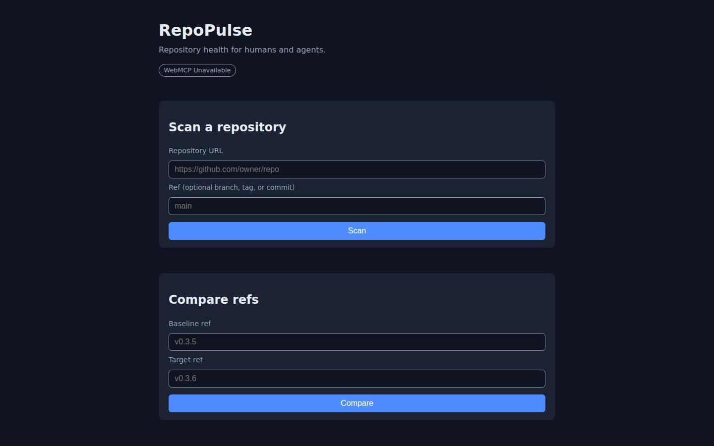

### 002. Abbas-Dev-786/change-frame

**Evidence:** Live app
[Project identity](https://github.com/Abbas-Dev-786/change-frame/blob/dca0b9a27dd546b85cd8cf82b776fbd44e4c27eb/devpost-submission.md) · [Captured page](https://change-frame.vercel.app)

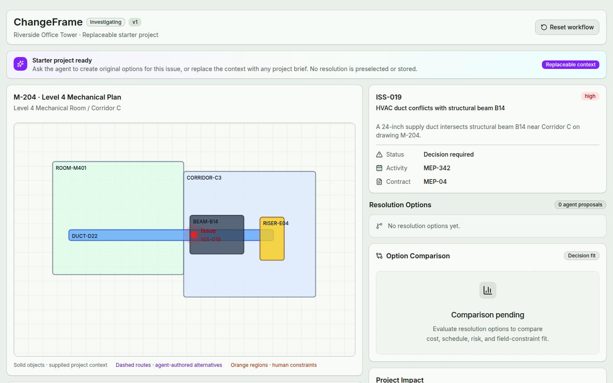

### 003. AccessLint/2D-webmcp-demo

**Evidence:** Live app
[Project identity](https://github.com/AccessLint/2D-webmcp-demo/blob/d13dcf4589280c6fc3e34ebb57cfb5174ad63495/devpost-submission.md) · [Captured page](https://2d-webmcp.netlify.app/)

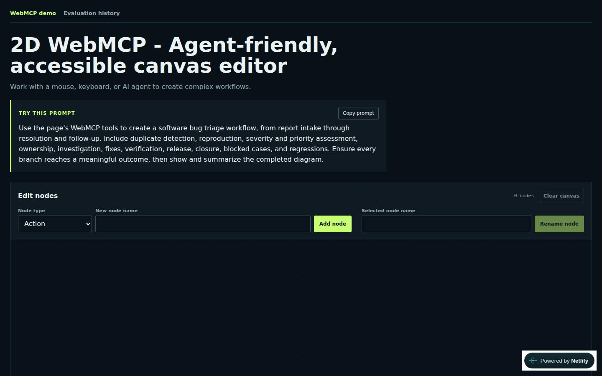

### 004. AdityaP9116/BuildReady

**Evidence:** Repository fallback
[Project identity](https://github.com/AdityaP9116/BuildReady/blob/cc6f763b2e7fffc31e0f5834c6cdcda77f8b3d1a/devpost-submission.md) · [Captured page](https://github.com/AdityaP9116/BuildReady)

_No working public demo was found in the brief/metadata, or the published live URL returned 404; the repository is shown instead._

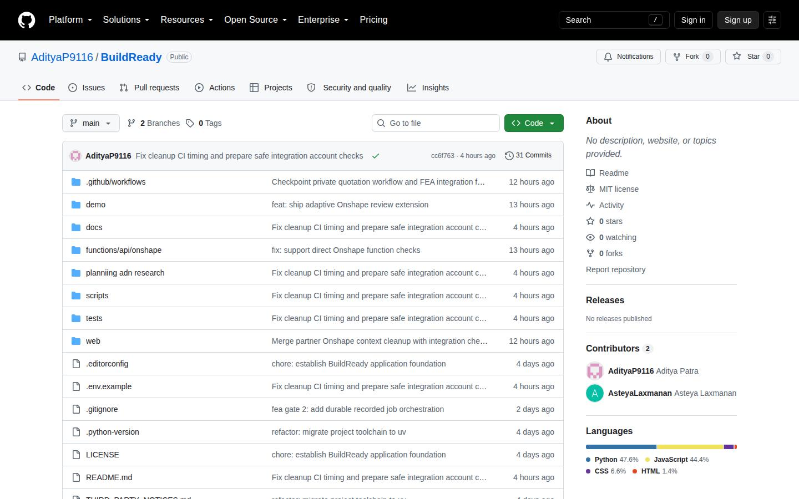

### 005. Anionix/verifiable-offline-webmcp-agent-spec

**Evidence:** Live app
[Project identity](https://github.com/Anionix/verifiable-offline-webmcp-agent-spec/blob/8d89609d3b582b5e076555a5635cb2e6f83175f7/devpost-submission.md) · [Captured page](https://kyoto-booking-retry-proof.vercel.app)

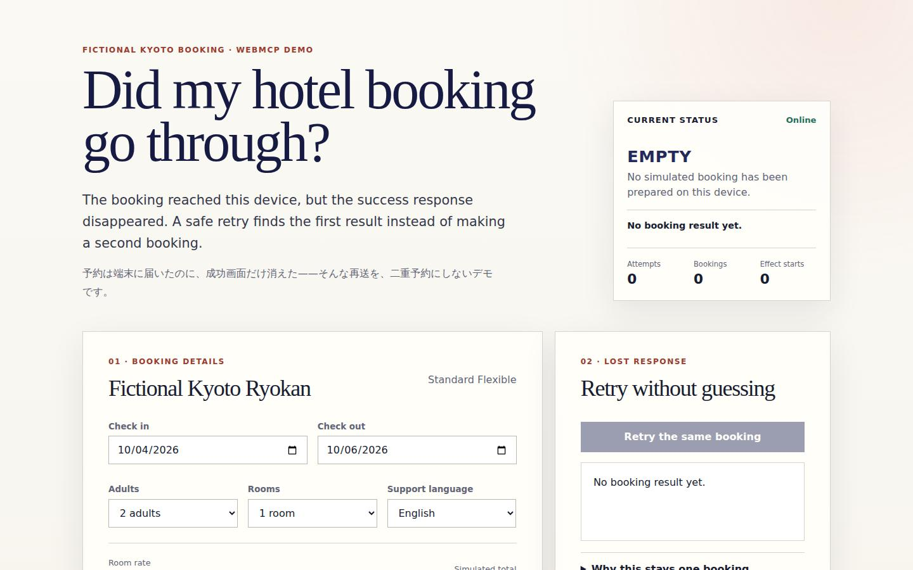

### 006. AnkanMisra/prodpermit

**Evidence:** Live app
[Project identity](https://github.com/AnkanMisra/prodpermit/blob/87d72ee851f9bf53c8d78264cd6fd5b67d389da0/devpost-submission.md) · [Captured page](https://recovery-control-room.vercel.app)

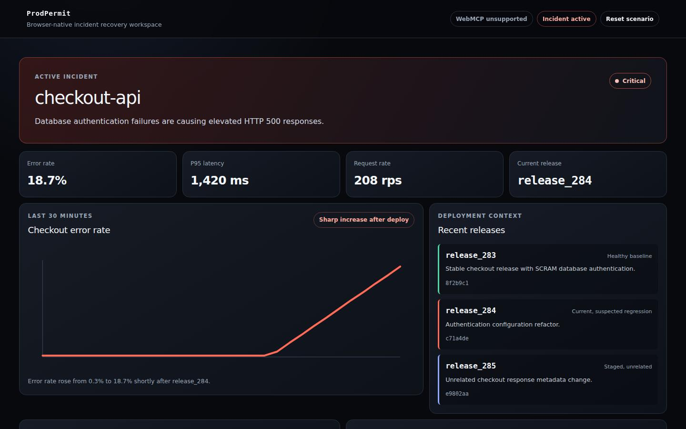

### 007. Avinash1286/benchpilot

**Evidence:** Live app
[Project identity](https://github.com/Avinash1286/benchpilot/blob/24880aab1886ba5c8996e6b76b0dd4084be2faf1/docs/devpost-submission.md) · [Captured page](https://benchpilot.abinashyadav3-141.chatgpt.site/demo)

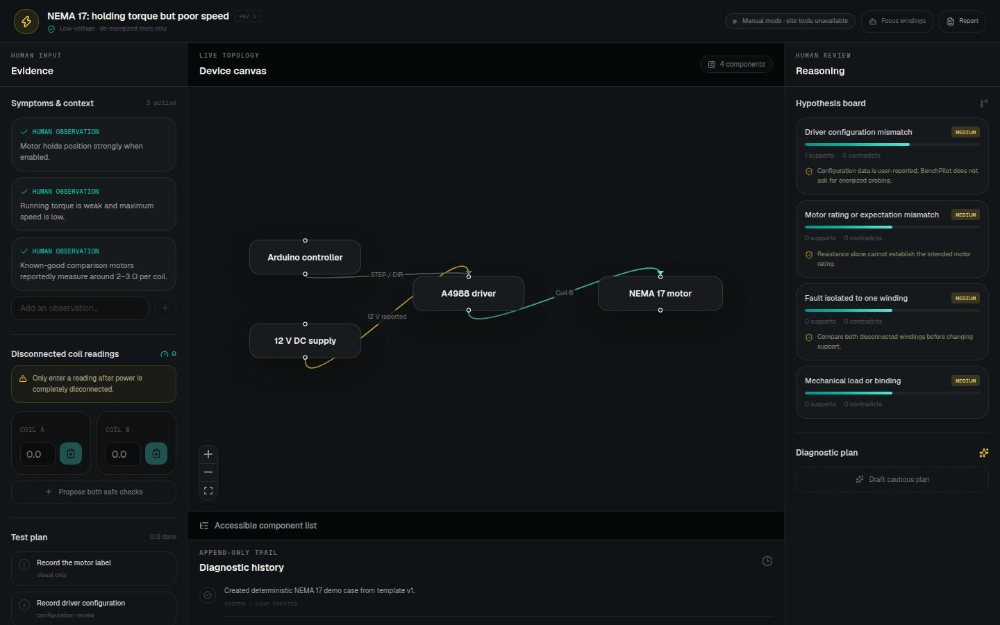

### 008. Daisuke134/life-manager

**Evidence:** Live app
[Project identity](https://github.com/Daisuke134/life-manager/blob/659deab7229e05b66ff445a6fba05c4df5229497/devpost-submission.md) · [Captured page](https://aniccaai.com/money-printer)

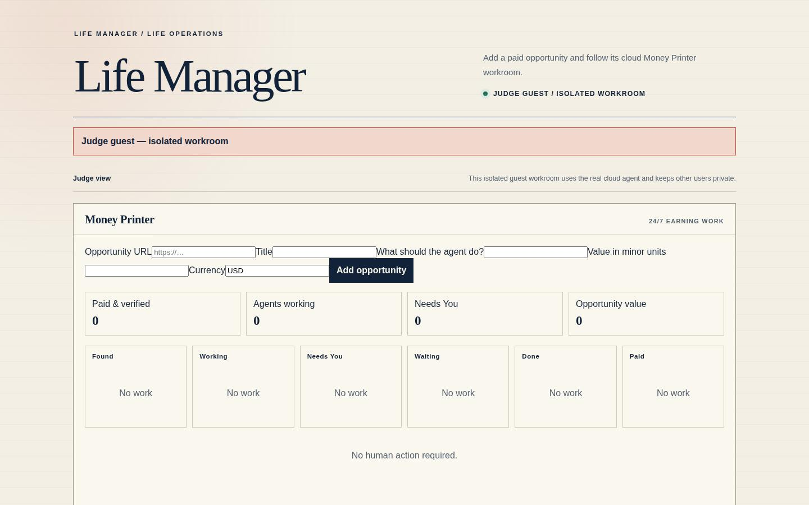

### 009. DonaldMurillo/field-assist-webmcp

**Evidence:** Live app
[Project identity](https://github.com/DonaldMurillo/field-assist-webmcp/blob/302fa0f0108f25ce9f2bc8e967f102d56cdbe85e/devpost-submission.md) · [Captured page](https://webmcp.donaldmurillo.com)

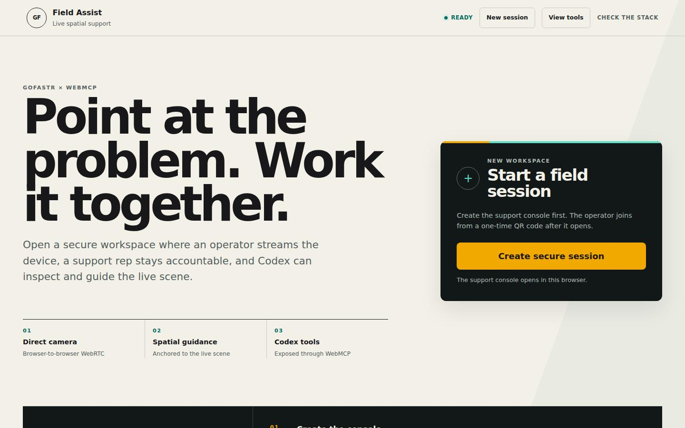

### 010. JacobLinCool/PaperSpace

**Evidence:** Live app
[Project identity](https://github.com/JacobLinCool/PaperSpace/blob/6ee2e226cb1f60453311db71397e1fe12312d823/devpost-submission.md) · [Captured page](https://paperspace.pages.dev/)

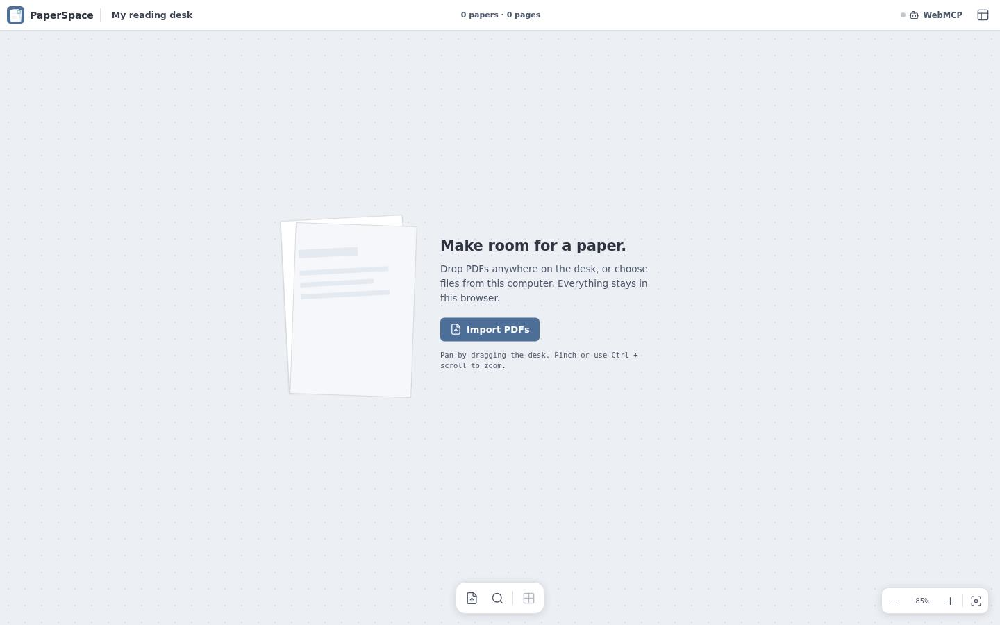

### 011. JamesWirths/threadline

**Evidence:** Live app
[Project identity](https://github.com/JamesWirths/threadline/blob/1be81465f25b7dcb7545c8d244eec11bc402860e/docs/devpost-submission.md) · [Captured page](https://threadline.jameswirths.chatgpt.site)

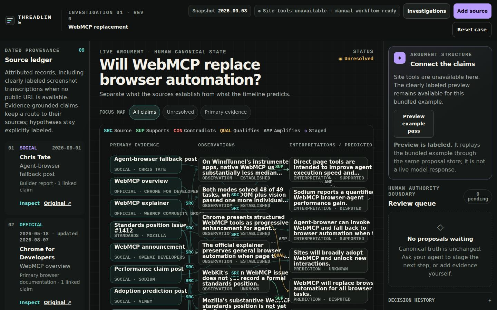

### 012. Joe-Simo/paradox-webmcp

**Evidence:** Live app
[Project identity](https://github.com/Joe-Simo/paradox-webmcp/blob/4c43ff6d08b044fdbcf7b9178fac553f424ed448/devpost-submission.md) · [Captured page](https://www.paradoxwebmcp.com/lab/expense-approval/ledger)

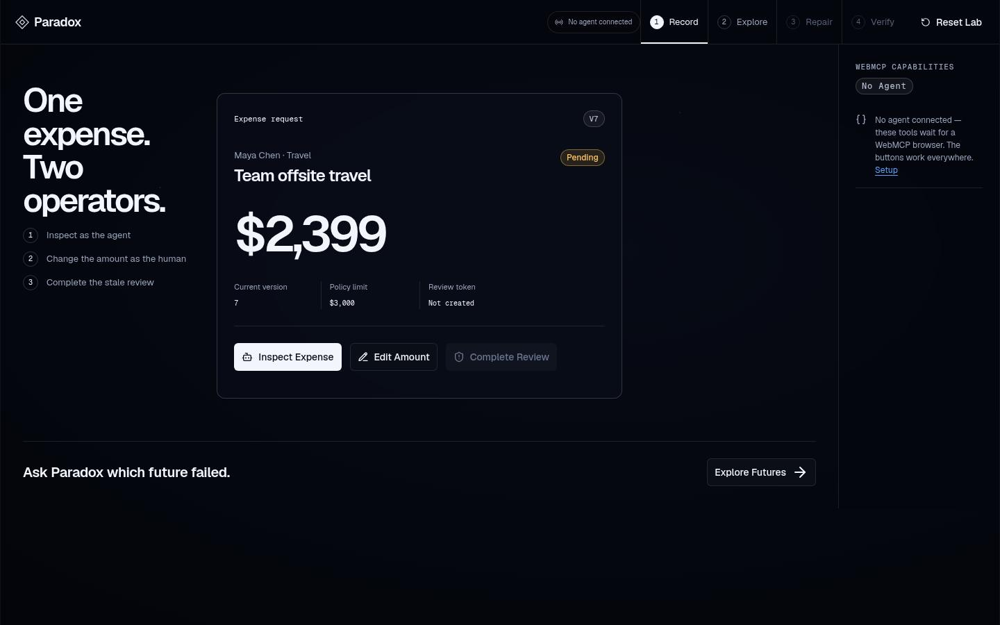

### 013. KkOma-value/persistent-web-skills-runtime

**Evidence:** Live app
[Project identity](https://github.com/KkOma-value/persistent-web-skills-runtime/blob/a100228f1256dfc5a727e2126214f7babd6a9a5f/devpost-submission.md) · [Captured page](https://persistent-web-skills-runtime.vercel.app)

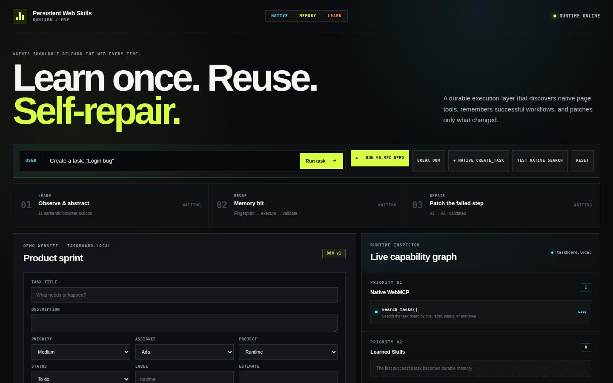

### 014. Kotakageyama/webMCP

**Evidence:** Live app
[Project identity](https://github.com/Kotakageyama/webMCP/blob/321cf67402f2ac1fa4f2f92926a71ddfcd5a84fb/docs/devpost-submission.md) · [Captured page](https://tasksurface-nlgt6zklja-an.a.run.app)

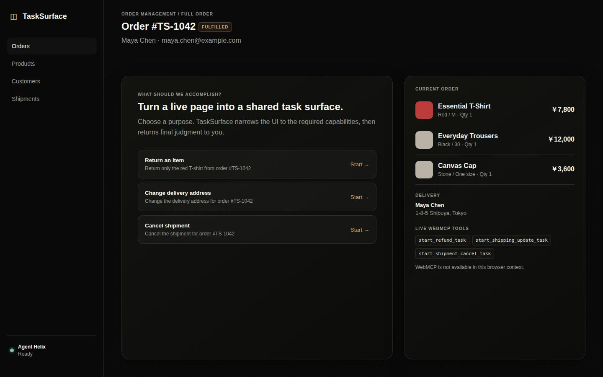

### 015. MichaelHo02/open-dots

**Evidence:** Live app
[Project identity](https://github.com/MichaelHo02/open-dots/blob/1b87945dfa6f04b4afc636eb479396bc87f64b6e/devpost-submission.md) · [Captured page](https://opendots.thach.app)

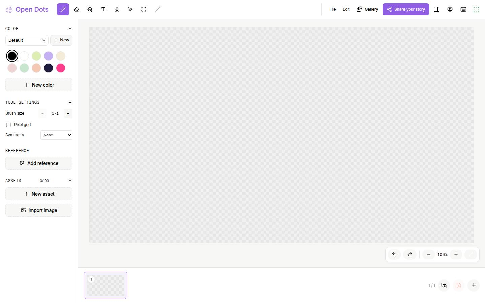

### 016. Nifemi0/scholarship-scout

**Evidence:** Live app
[Project identity](https://github.com/Nifemi0/scholarship-scout/blob/f424f81d914b92ebc2921be9c64a5cba09330224/devpost-submission.md) · [Captured page](https://scholarship-scout-brown.vercel.app)

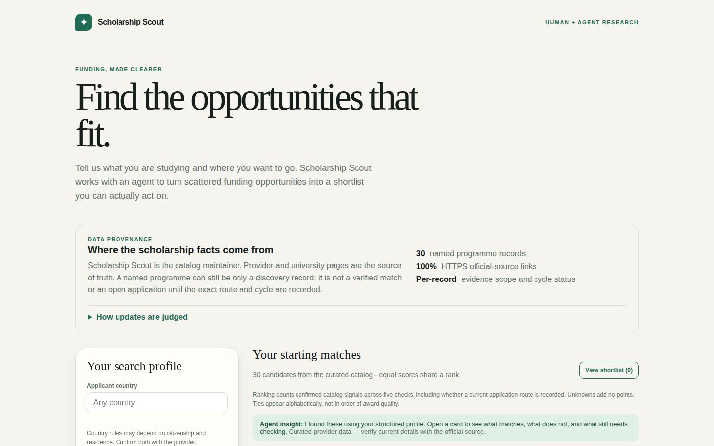

### 017. SeCuReDmE-main-dev/webmcp-hackathon-2026

**Evidence:** Live app
[Project identity](https://github.com/SeCuReDmE-main-dev/webmcp-hackathon-2026/blob/dbd77d249b33c69036fd46d34893929079f68756/devpost-submission.md) · [Captured page](https://qcg.securedme.ca/)

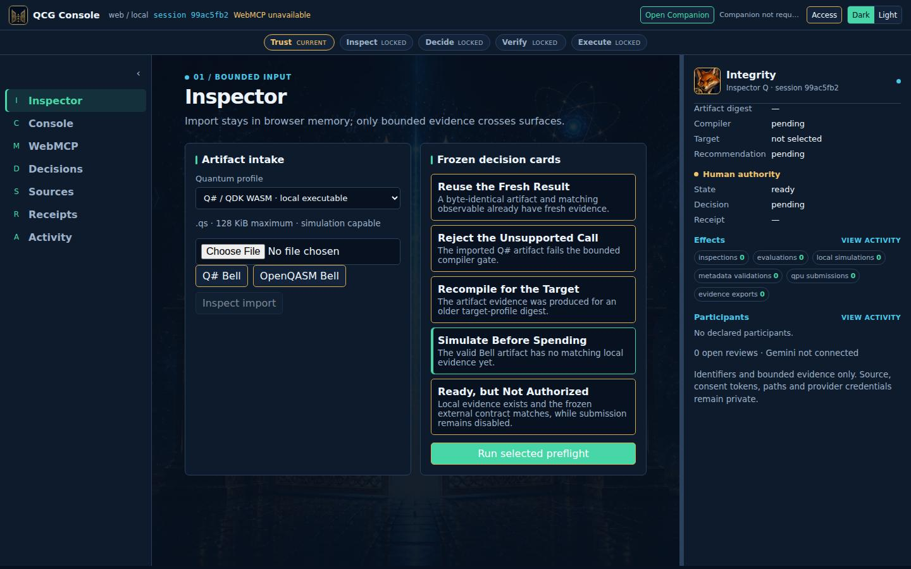

### 018. SebastianBoehler/webmcp-structural-evolution

**Evidence:** Live app
[Project identity](https://github.com/SebastianBoehler/webmcp-structural-evolution/blob/cd83730b744f74f22dc8392529747a5b9a1486b2/devpost-submission.md) · [Captured page](https://webmcp-structural-evolution.vercel.app)

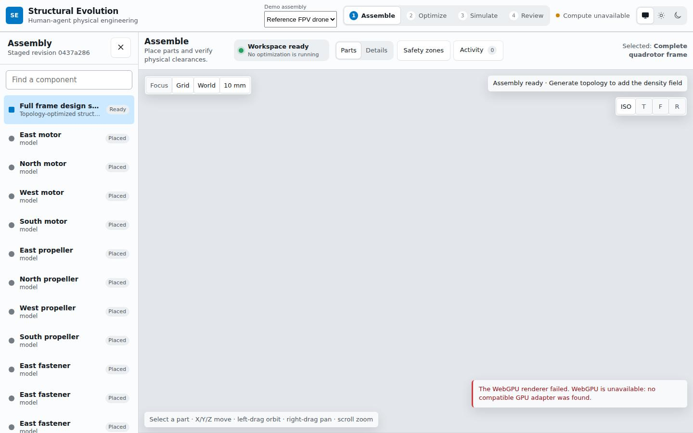

### 019. Trueuss/baw-webmcp

**Evidence:** Repository fallback
[Project identity](https://github.com/Trueuss/baw-webmcp/blob/34b5e6705459dc3d40c14eebf58ad238740ea8a7/devpost-submission.md) · [Captured page](https://github.com/Trueuss/baw-webmcp)

_No working public demo was found in the brief/metadata, or the published live URL returned 404; the repository is shown instead._

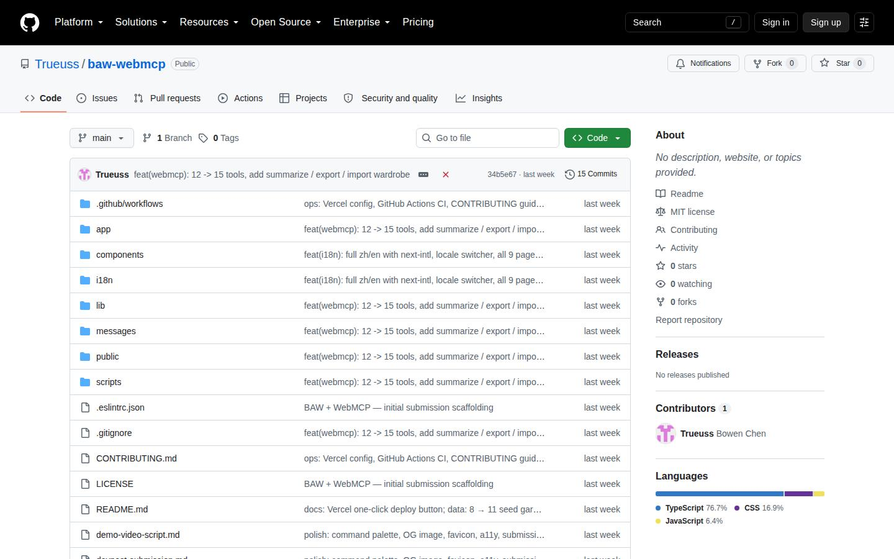

### 020. VitalJeevanjot/time-and-dime

**Evidence:** Repository fallback
[Project identity](https://github.com/VitalJeevanjot/time-and-dime/blob/1a89356f7adda218277db4ef961b0dcb13382c51/devpost-submission.md) · [Captured page](https://github.com/VitalJeevanjot/time-and-dime)

_No working public demo was found in the brief/metadata, or the published live URL returned 404; the repository is shown instead._

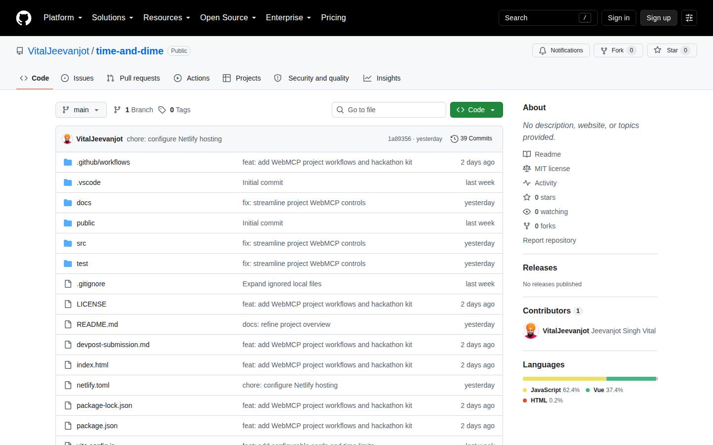

### 021. ajaknumber4/action-check-webmcp

**Evidence:** Live app
[Project identity](https://github.com/ajaknumber4/action-check-webmcp/blob/ea40df68f81319d7f85f2873a99a4a2dfe3e0e98/devpost-submission.md) · [Captured page](https://action-check-webmcp.vercel.app)

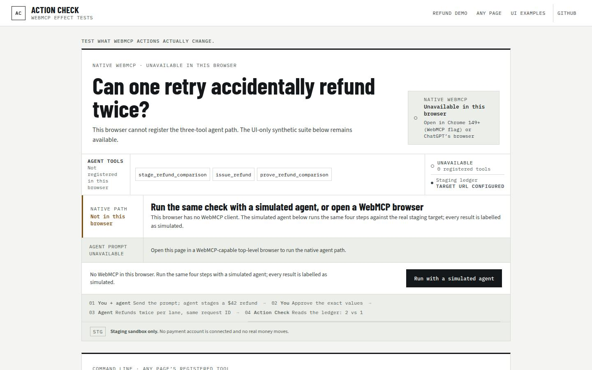

### 022. balsimpson/widgetr

**Evidence:** Live app
[Project identity](https://github.com/balsimpson/widgetr/blob/ccb0e9d2cf58a854c368f54320f368b6796c0112/devpost-submission.md) · [Captured page](https://widgetrmcp.vercel.app/)

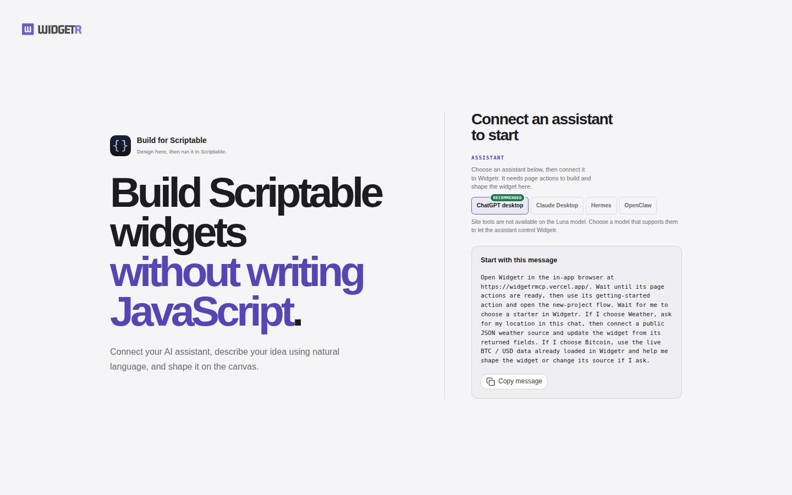

### 023. bpais88/Parley

**Evidence:** Live app
[Project identity](https://github.com/bpais88/Parley/blob/ac83ce0bd7ee8e16d21082c59161007ab64a0426/devpost-submission.md) · [Captured page](https://parleywebmcp.vercel.app/demo)

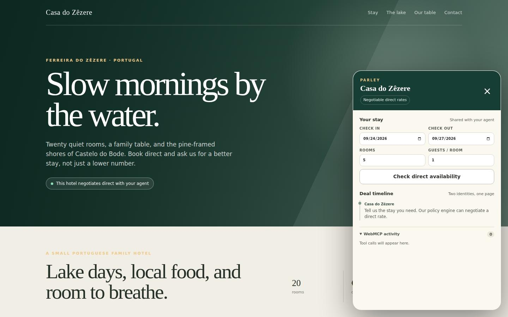

### 024. calc2te/northstar-webmcp-challenge

**Evidence:** Repository fallback
[Project identity](https://github.com/calc2te/northstar-webmcp-challenge/blob/572c1d415baa0982bcd20359ce27eeba351435e6/docs/devpost-submission.md) · [Captured page](https://github.com/calc2te/northstar-webmcp-challenge)

_No working public demo was found in the brief/metadata, or the published live URL returned 404; the repository is shown instead._

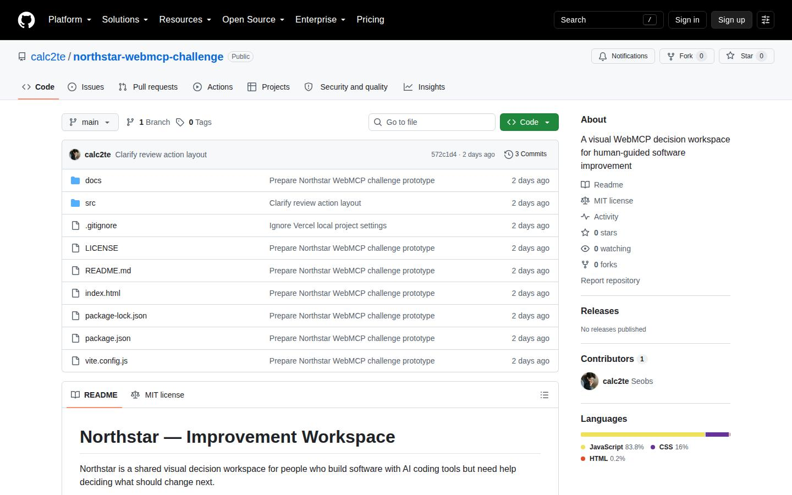

### 025. chvignesh07/focus-contract-studio

**Evidence:** Live app
[Project identity](https://github.com/chvignesh07/focus-contract-studio/blob/835cb812faf8ec043486b2e0ebec7d7784236dbb/devpost-submission.md) · [Captured page](https://focus-contract-studio-package-0.newmailforyouvignesh.chatgpt.site/)

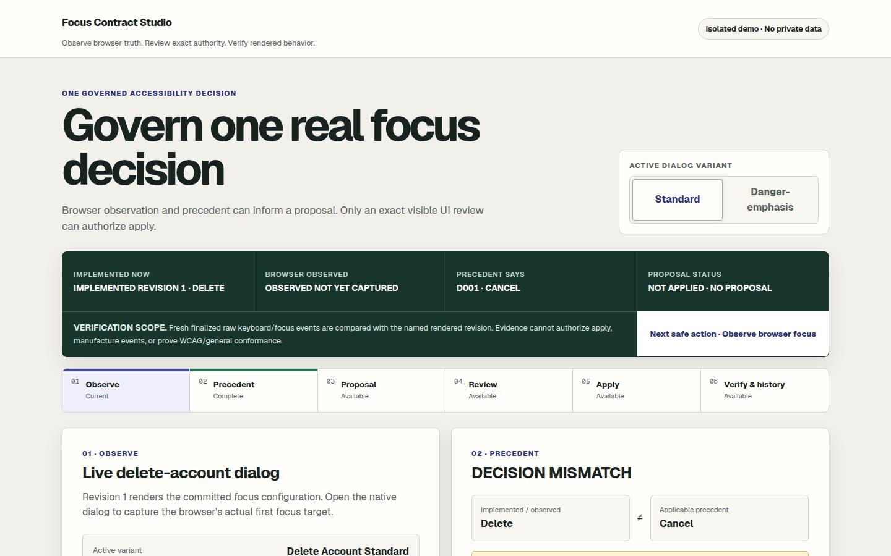

### 026. dorakingx/ruleloom

**Evidence:** Live app
[Project identity](https://github.com/dorakingx/ruleloom/blob/54f04b11d26b608ae7190412230b78a4be1d82ad/devpost-submission.md) · [Captured page](https://ruleloom-nu.vercel.app)

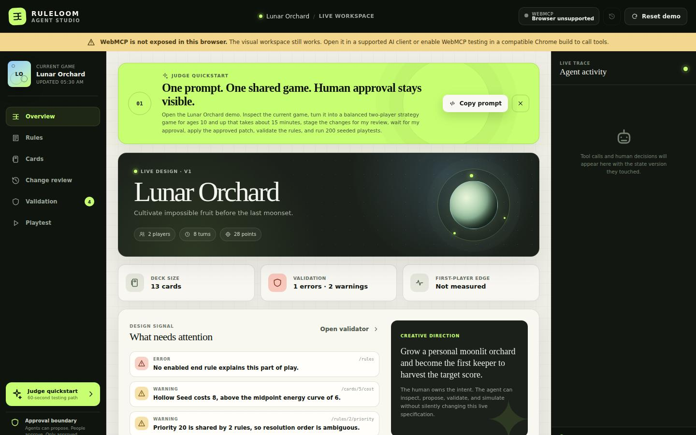

### 027. eliadco5/NavWebmcp

**Evidence:** Live app
[Project identity](https://github.com/eliadco5/NavWebmcp/blob/c2d5fe7f5852e81af7c913bd4f50078166696e96/docs/devpost-submission.md) · [Captured page](https://nav-webmcp.vercel.app)

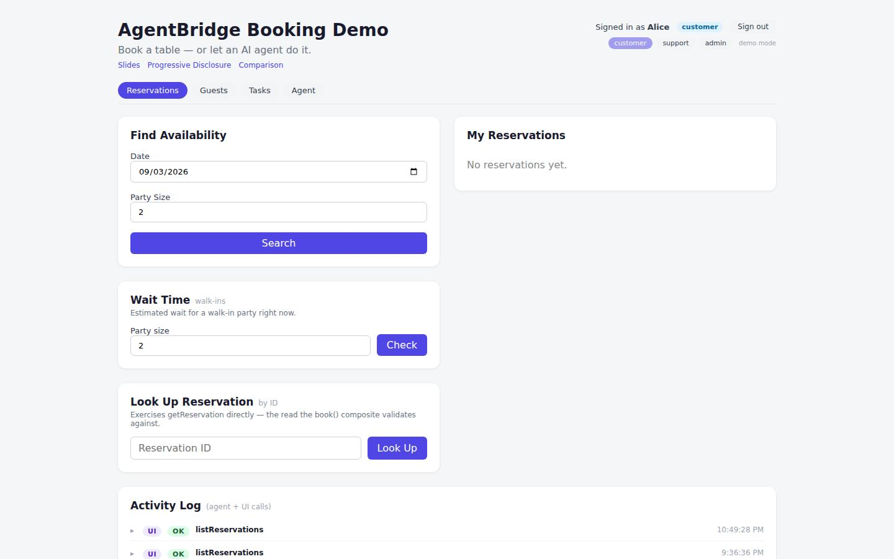

### 028. haakanergun/gridbrief-tr

**Evidence:** Live app
[Project identity](https://github.com/haakanergun/gridbrief-tr/blob/c6b4e94a4f1a19216e851aee642a9829a0c5cf9f/work/devpost-submission.md) · [Captured page](https://haakanergun.github.io/gridbrief-tr/)

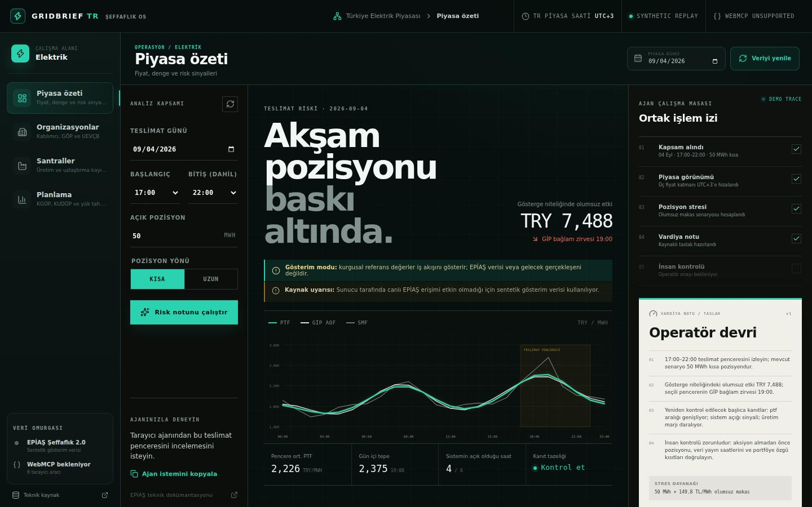

### 029. ibrinzila/signalui-interface-on-demand

**Evidence:** Live app
[Project identity](https://github.com/ibrinzila/signalui-interface-on-demand/blob/46c57a492ab8cd1ef744ad0ce77e7ce9d9541dcb/docs/devpost-submission.md) · [Captured page](https://signalui-interface-on-demand.pages.dev)

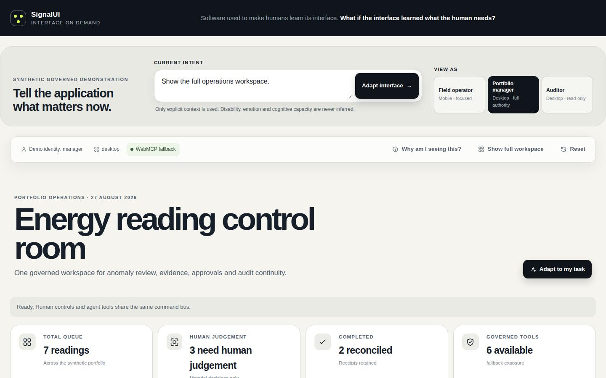

### 030. jongan69/RoarCAD

**Evidence:** Live app
[Project identity](https://github.com/jongan69/RoarCAD/blob/57770d8c18f0bbee624f9ed453b4d036bd0b1e42/devpost-submission.md) · [Captured page](https://roarcad.netlify.app/)

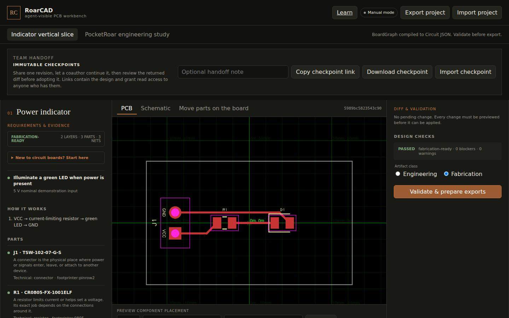

### 031. kjs844-art/offerproof-webmcp

**Evidence:** Live app
[Project identity](https://github.com/kjs844-art/offerproof-webmcp/blob/6ed442e753a1c0bc776578dec7647154a4482e6d/devpost-submission.md) · [Captured page](https://kjs844-art.github.io/offerproof-webmcp/)

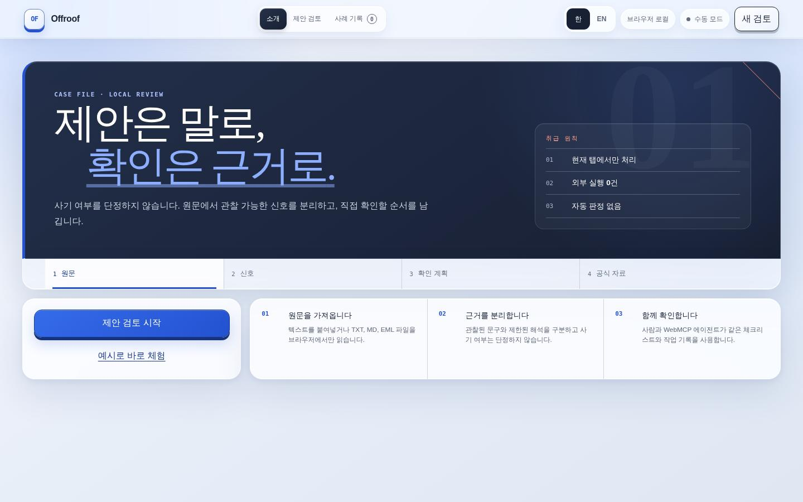

### 032. manikv12/OpenAssist

**Evidence:** Live app
[Project identity](https://github.com/manikv12/OpenAssist/blob/0929946584925bc3278be9973a0d167543ec9d1c/docs/webmcp-devpost-submission.md) · [Captured page](https://openassist-daily-workspace.developingadventures.chatgpt.site/)

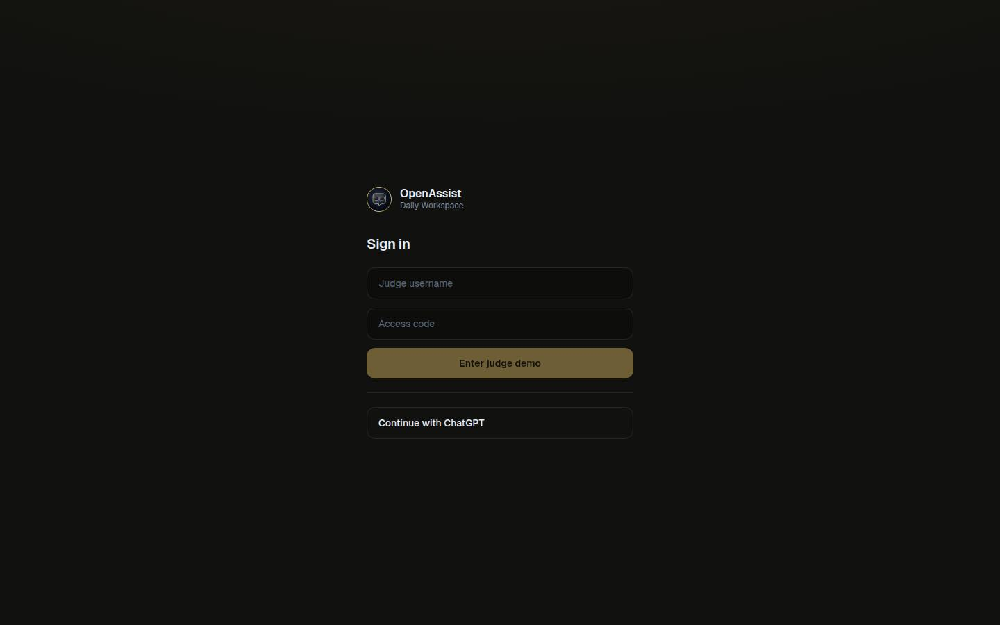

### 033. mathiasonea/relaybench

**Evidence:** Live app
[Project identity](https://github.com/mathiasonea/relaybench/blob/205aafb83b8c057407abb2dadd7b650db76adace/docs/devpost-submission.md) · [Captured page](https://relaybench.mathias-onea.chatgpt.site/)

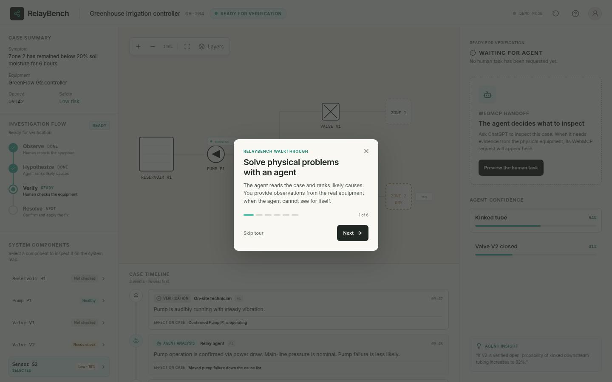

### 034. meabs/ResilienceForge

**Evidence:** Live app
[Project identity](https://github.com/meabs/ResilienceForge/blob/f92dbdd3ac36a4394d92c4e6754522bda2d54114/devpost-submission.md) · [Captured page](https://resilience-forge.gman72.chatgpt.site/)

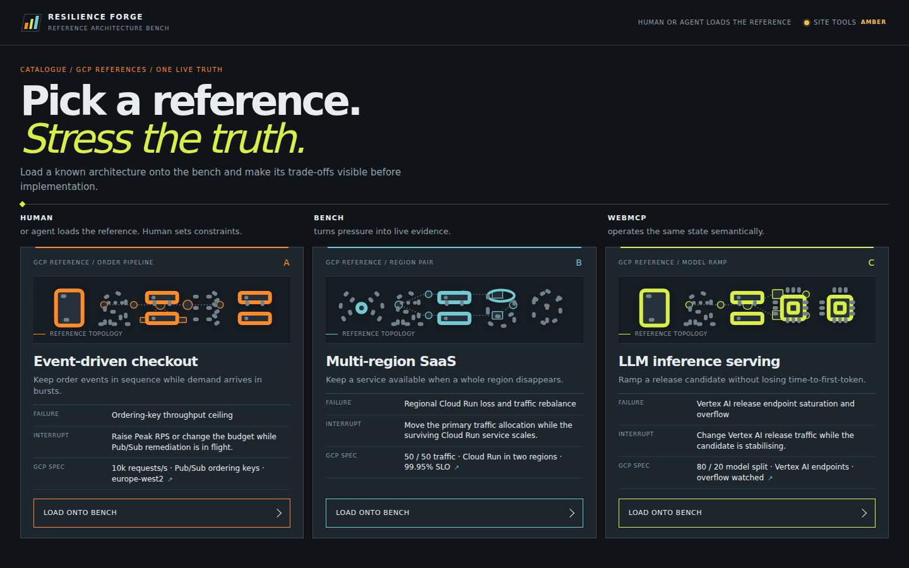

### 035. misterkidult/ai-nomos

**Evidence:** Live app
[Project identity](https://github.com/misterkidult/ai-nomos/blob/7d81cdbe0a516c2464815dcd482bc17b8715661b/context/devpost-submission.md) · [Captured page](https://ai-nomos.vercel.app)

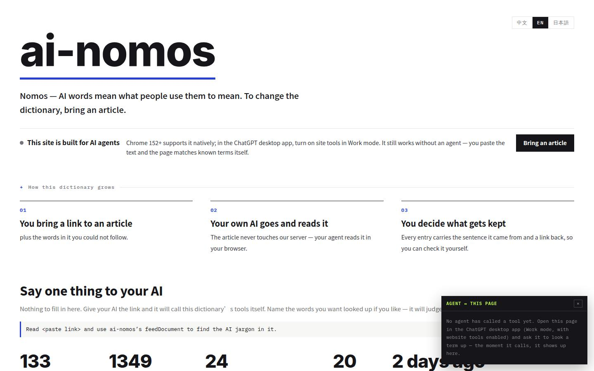

### 036. onEnterFrame/coursemcp

**Evidence:** Live app
[Project identity](https://github.com/onEnterFrame/coursemcp/blob/5539dbe0064a2ce9d12cd66afd622274586db393/docs/devpost-submission.md) · [Captured page](https://coursemcp-webmcp.onrender.com)

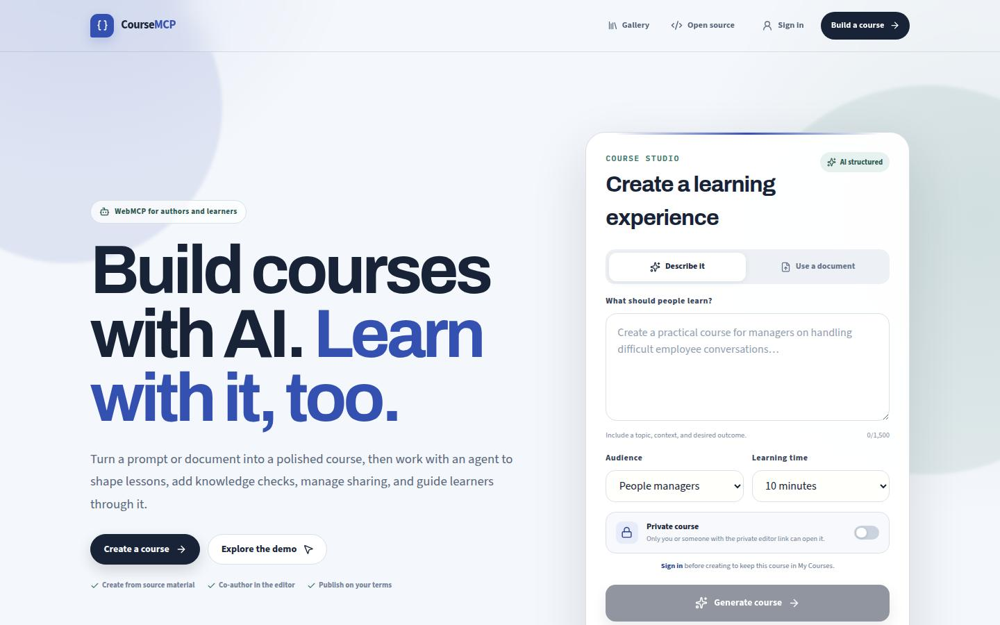

### 037. onerandomd3v/Web-MCP-Vision-Tool

**Evidence:** Live app
[Project identity](https://github.com/onerandomd3v/Web-MCP-Vision-Tool/blob/04d7db538449496682d00422ea0eb5e65d94bc29/devpost-submission.md) · [Captured page](https://webmcp-vision-tool.vercel.app/)

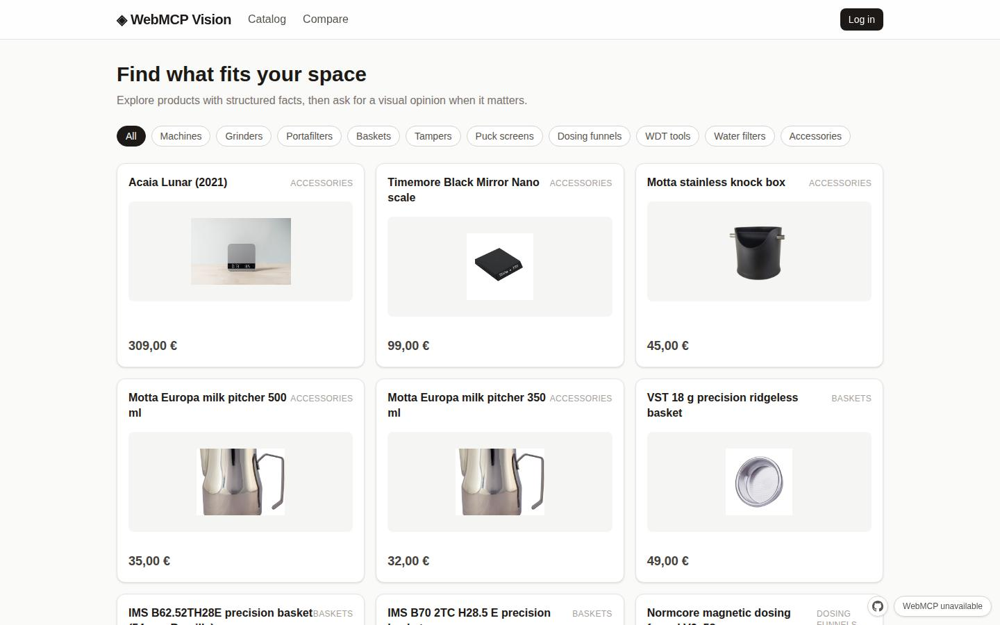

### 038. ostheimer/webmcp-simulator

**Evidence:** Live app
[Project identity](https://github.com/ostheimer/webmcp-simulator/blob/9435f301fbd7e4c2656ddab16706b6a17214a915/docs/devpost-submission.md) · [Captured page](https://webmcp-simulator.vercel.app/)

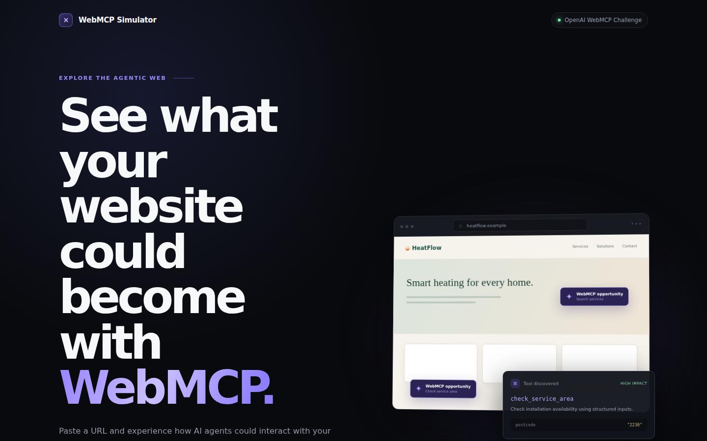

### 039. patrickjcraig/PaperPilot

**Evidence:** Live app
[Project identity](https://github.com/patrickjcraig/PaperPilot/blob/b53ef7c984d00d0d01b403ab04da252042d01200/devpost-submission.md) · [Captured page](https://patrickjcraig.github.io/PaperPilot/webmcp/)

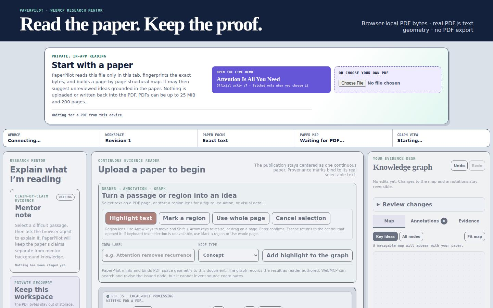

### 040. romiteld/commandcanvas

**Evidence:** Live app
[Project identity](https://github.com/romiteld/commandcanvas/blob/ec48964cce011f40619302aba6a80eeee8b86112/docs/devpost-submission.md) · [Captured page](https://commandcanvas.vercel.app/demo)

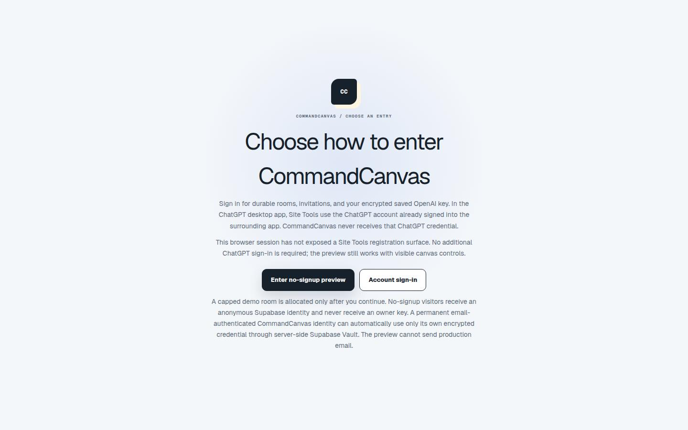

### 041. samueltate/adaptive-webmcp

**Evidence:** Live app
[Project identity](https://github.com/samueltate/adaptive-webmcp/blob/1d04115062b9dd6bc3f7decd854dbdd249cea7b4/devpost-submission.md) · [Captured page](https://adaptive-web.nextszn.chatgpt.site)

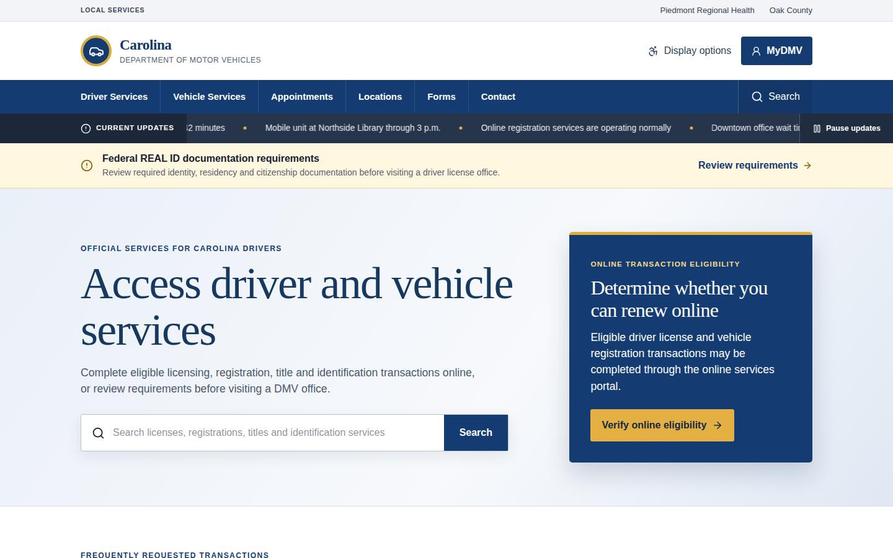

### 042. sin4ch/MetaEdit

**Evidence:** Repository fallback
[Project identity](https://github.com/sin4ch/MetaEdit/blob/88ef15431c5b5b954f7b8dbb2be12dd01321e3c8/devpost-submission.md) · [Captured page](https://github.com/sin4ch/MetaEdit)

_No working public demo was found in the brief/metadata, or the published live URL returned 404; the repository is shown instead._

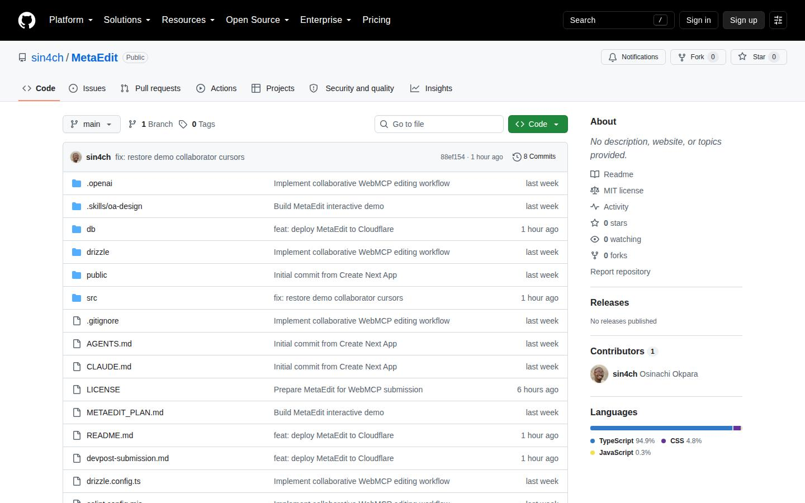

### 043. stevensuna/floodstudio

**Evidence:** Project-owned screenshot
[Project identity](https://github.com/stevensuna/floodstudio/blob/fdfdd2e75333dce75a1a180ef34896455bb30b5c/docs/hackathon-build/devpost-submission.md) · [Captured page](https://raw.githubusercontent.com/stevensuna/floodstudio/fdfdd2e75333dce75a1a180ef34896455bb30b5c/tests/e2e/shell.spec.ts-snapshots/flood-studio-1440-desktop-1440-linux.png)

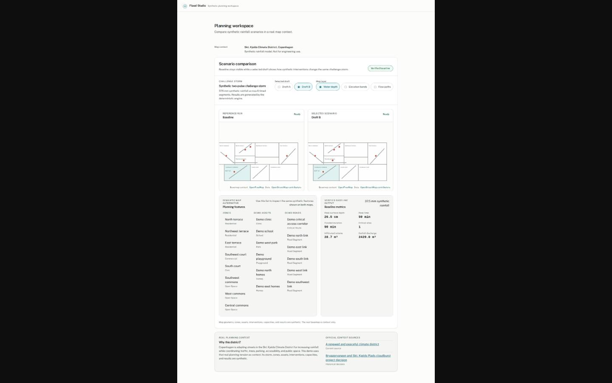

### 044. tomishninja/Schedule-Rank-WebMCP-Adapter

**Evidence:** Live app
[Project identity](https://github.com/tomishninja/Schedule-Rank-WebMCP-Adapter/blob/7fd9f7f88ad737dd9c16db38c00ad8143a1e5828/devpost-submission.md) · [Captured page](https://tomishninja.github.io/MCPDemos/northside-aircon/)

### 045. wordlift/ai-audit-webmcp

**Evidence:** Live app
[Project identity](https://github.com/wordlift/ai-audit-webmcp/blob/fd6ab21a1148726c8687bdf80463549c540efa6b/devpost-submission.md) · [Captured page](https://beta.audit.wordlift.io/demo/alpina)

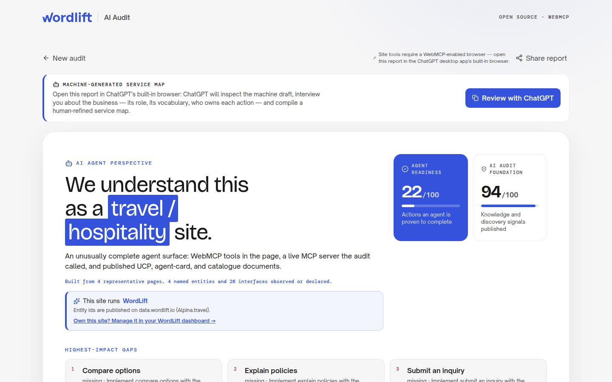

### 046. zac/webmcp-card-table

**Evidence:** Live app
[Project identity](https://github.com/zac/webmcp-card-table/blob/97c2a894116d5839f5a0ad7c925dabbeae68c074/devpost-submission.md) · [Captured page](https://webmcp-card-table.zacwhite.workers.dev/)

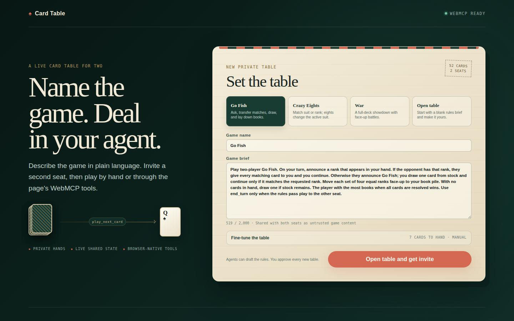

### 047. zaeem-rafiq/nwa-growth-signal-webmcp

**Evidence:** Live app
[Project identity](https://github.com/zaeem-rafiq/nwa-growth-signal-webmcp/blob/10d26de04e634222a3245207146ce5184e75b04e/devpost-submission.md) · [Captured page](https://nwa-growth-signal-webmcp.pages.dev/)

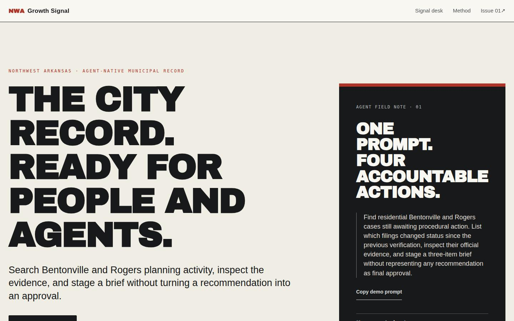

## Devpost-confirmed projects not in the GitHub brief set (15)

### 048. SheetCanvas

**Evidence:** Live app
[Project identity](https://devpost.com/software/sheetcanvas) · [Captured page](https://sheetcanvas.com/)

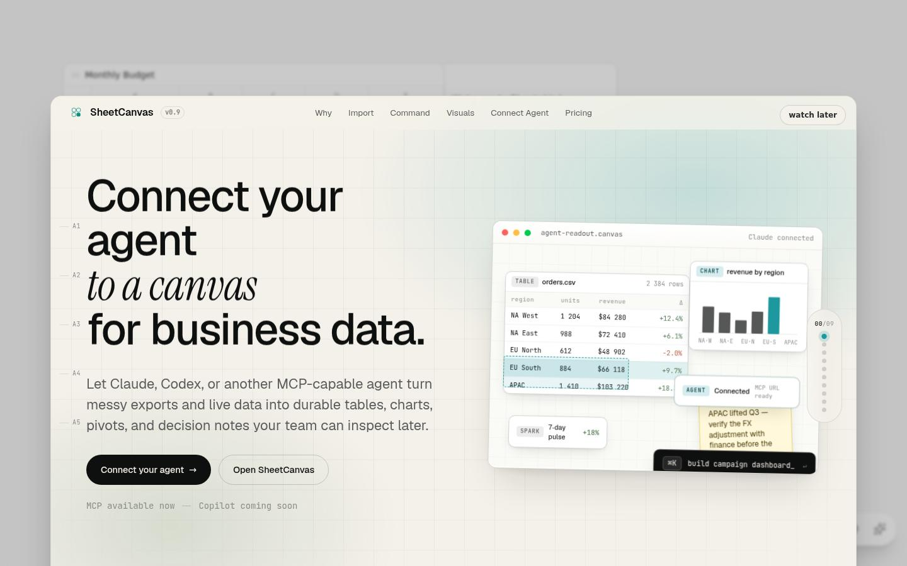

### 049. VT

**Evidence:** Live app
[Project identity](https://devpost.com/software/vt-y4n8u0) · [Captured page](https://vinhnx.github.io/VTCode/)

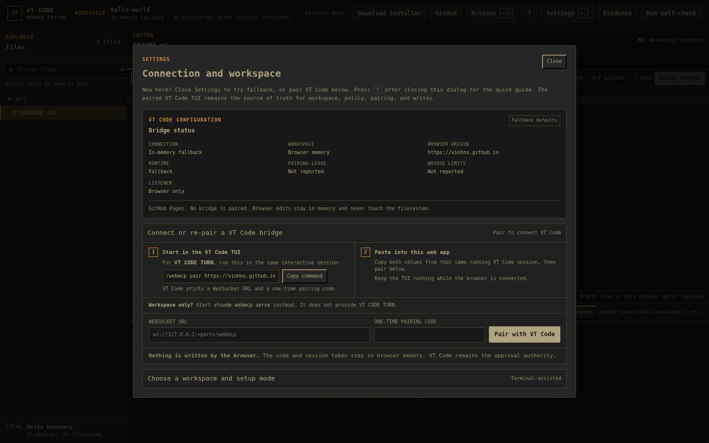

### 050. Gallery 402

**Evidence:** Live app
[Project identity](https://devpost.com/software/gallery-402) · [Captured page](https://gallery402.stacktr.ee/)

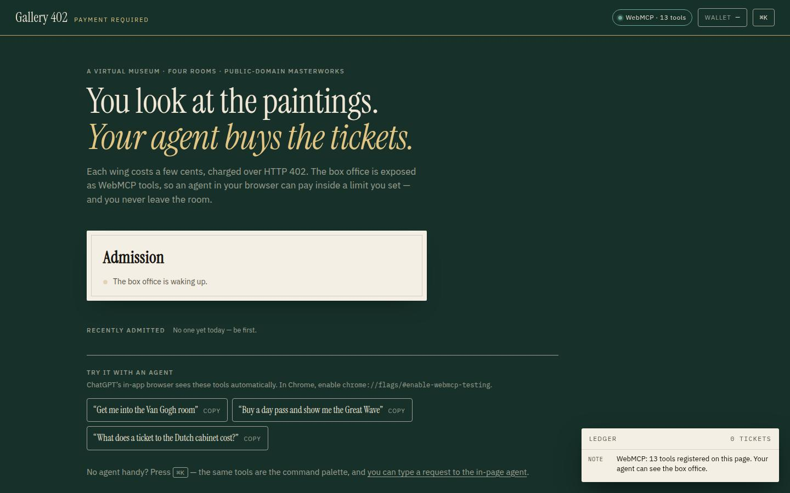

### 051. MIRROR//LOOP

**Evidence:** Live app
[Project identity](https://devpost.com/software/mirror-loop) · [Captured page](https://mirrorloopai.com/)

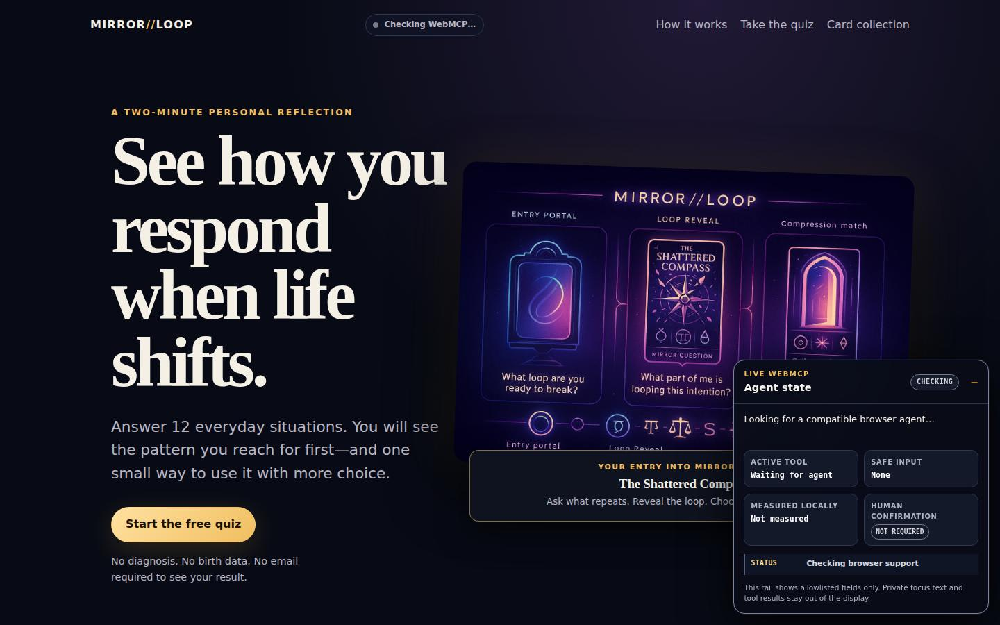

### 052. Mike the Cat's Moonlight Run

**Evidence:** Live app
[Project identity](https://devpost.com/software/mike-s-moonlight-run) · [Captured page](https://mike-moonlight-run.rojii.chatgpt.site/)


### 053. Dependency War Room

**Evidence:** YouTube demo frame
[Project identity](https://devpost.com/software/dependency-war-room) · [Captured page](https://www.youtube.com/watch?v=NXZ91VKMxF4)


### 054. Teachback

**Evidence:** Live app
[Project identity](https://devpost.com/software/teachback-de9cr3) · [Captured page](https://teachback-webmcp.haygsiiii.chatgpt.site/)


### 055. Redini-Atelier

**Evidence:** Live app
[Project identity](https://devpost.com/software/redini-atelier) · [Captured page](https://redini-atelier.netlify.app/)


### 056. MCPencil

**Evidence:** Live app
[Project identity](https://devpost.com/software/mcpencil) · [Captured page](https://mcpencil.com/)


### 057. tobidas

**Evidence:** YouTube demo frame
[Project identity](https://devpost.com/software/tobidas) · [Captured page](https://www.youtube.com/watch?v=h3byg2tNE_o)


### 058. Taste Gate

**Evidence:** Live app
[Project identity](https://devpost.com/software/taste-gate) · [Captured page](https://akari-h-111.github.io/taste-packet/Taste%20Gate/)


### 059. The Coop

**Evidence:** Live app
[Project identity](https://devpost.com/software/the-coop) · [Captured page](https://test-game.bazireader.com/)


### 060. AI Lovey-Dovey Kyun-Kyun!

**Evidence:** YouTube demo frame
[Project identity](https://devpost.com/software/ai-lovey-dovey-kyun-kyun-our-first-mission-together) · [Captured page](https://www.youtube.com/watch?v=YNCxhoZepDU)


### 061. LedgerAgent AI

**Evidence:** YouTube demo frame
[Project identity](https://devpost.com/software/developers-xa3nw7) · [Captured page](https://www.youtube.com/watch?v=4_IE5Kq1Sp0)


### 062. Interactive Star Lab

**Evidence:** Live app
[Project identity](https://devpost.com/software/interactive-star-lab) · [Captured page](https://interactive-star-lab.vercel.app/)


## YouTube-only project candidates (42)

### 063. AgentGate

**Evidence:** YouTube demo frame
[Project identity](https://www.youtube.com/watch?v=EmpHneJSSlw)


### 064. Blickwinkel

**Evidence:** YouTube demo frame
[Project identity](https://www.youtube.com/watch?v=oaxNlDZ15DM)


### 065. Brenych Studio Agent Interface

**Evidence:** YouTube demo frame
[Project identity](https://www.youtube.com/watch?v=1l0x9pEbJS4)


### 066. ClaimReady

**Evidence:** YouTube demo frame
[Project identity](https://www.youtube.com/watch?v=gdCeoWgyegY)


### 067. ClearRights Privacy

**Evidence:** YouTube demo frame
[Project identity](https://www.youtube.com/watch?v=jZI10DsSWyg)


### 068. Conductor WebMCP

**Evidence:** YouTube demo frame
[Project identity](https://www.youtube.com/watch?v=_pNX7ZZ43YU)


### 069. CoSpace

**Evidence:** YouTube demo frame
[Project identity](https://www.youtube.com/watch?v=1fUlMDDR7CY)


### 070. Dazwischenfunken

**Evidence:** YouTube demo frame
[Project identity](https://www.youtube.com/watch?v=B3qbrK8W5Kw)


### 071. DealTable

**Evidence:** YouTube demo frame
[Project identity](https://www.youtube.com/watch?v=-zPTvL9Deso)


### 072. Front Desk

**Evidence:** YouTube demo frame
[Project identity](https://www.youtube.com/watch?v=07lGOuDaZAc)


### 073. Duet

**Evidence:** YouTube demo frame
[Project identity](https://www.youtube.com/watch?v=-woEVj6zaS0)


### 074. Forsyningsdata Danmark

**Evidence:** YouTube demo frame
[Project identity](https://www.youtube.com/watch?v=q0HNQk3voBw)


### 075. GeoMart

**Evidence:** YouTube demo frame
[Project identity](https://www.youtube.com/watch?v=HKDsfzZTbLs)


### 076. HomeWheel

**Evidence:** YouTube demo frame
[Project identity](https://www.youtube.com/watch?v=gga0UbnX4PY)


### 077. Inkframe

**Evidence:** YouTube demo frame
[Project identity](https://www.youtube.com/watch?v=goNRyhAkRio)


### 078. Know Before Yes

**Evidence:** YouTube demo frame
[Project identity](https://www.youtube.com/watch?v=muJlYADo1Zg)


### 079. LAFRYHI AgentCut

**Evidence:** YouTube demo frame
[Project identity](https://www.youtube.com/watch?v=QGL906UeoYo)


### 080. Lantern

**Evidence:** YouTube demo frame
[Project identity](https://www.youtube.com/watch?v=JPlWgPr49l8)


### 081. NetSpectre

**Evidence:** YouTube demo frame
[Project identity](https://www.youtube.com/watch?v=U3N7XXOGOwk)


### 082. NeXaCard WebMCP

**Evidence:** YouTube demo frame
[Project identity](https://www.youtube.com/watch?v=Xvjc0S39DGQ)


### 083. Ninth Tool

**Evidence:** YouTube demo frame
[Project identity](https://www.youtube.com/watch?v=P8Sc6XnVJI8)


### 084. Project Notebook

**Evidence:** YouTube demo frame
[Project identity](https://www.youtube.com/watch?v=d062EVrH0Cw)


### 085. Alpix

**Evidence:** YouTube demo frame
[Project identity](https://www.youtube.com/watch?v=tTXIufDSL5w)


### 086. Ops Co-pilot

**Evidence:** YouTube demo frame
[Project identity](https://www.youtube.com/watch?v=GxwUFkXc6oI)


### 087. Pitch The AI

**Evidence:** YouTube demo frame
[Project identity](https://www.youtube.com/watch?v=RuVrJTvDSc4)


### 088. Polkaswap

**Evidence:** YouTube demo frame
[Project identity](https://www.youtube.com/watch?v=S9xtCkkbbAE)


### 089. Quorum

**Evidence:** YouTube demo frame
[Project identity](https://www.youtube.com/watch?v=x4eKV-wZWwU)


### 090. ROVE

**Evidence:** YouTube demo frame
[Project identity](https://www.youtube.com/watch?v=BX28HKKD6wQ)


### 091. Semantic City

**Evidence:** YouTube demo frame
[Project identity](https://www.youtube.com/watch?v=DnSRjhxaqMs)


### 092. SeriesSafe

**Evidence:** YouTube demo frame
[Project identity](https://www.youtube.com/watch?v=tmLKKPgGdEc)


### 093. SLOPBOT

**Evidence:** YouTube demo frame
[Project identity](https://www.youtube.com/watch?v=YXWwk4QnwzY)


### 094. StagedOps

**Evidence:** YouTube demo frame
[Project identity](https://www.youtube.com/watch?v=oYLwhqedd-c)


### 095. TBR

**Evidence:** YouTube demo frame
[Project identity](https://www.youtube.com/watch?v=7HRfz-xouaQ)


### 096. The Between: Visiting Minds

**Evidence:** YouTube demo frame
[Project identity](https://www.youtube.com/watch?v=Got_uoo_l_Q)


### 097. Versailles - The Thread of Time

**Evidence:** YouTube demo frame
[Project identity](https://www.youtube.com/watch?v=XsjfANUBmD8)


### 098. VoiceGuard

**Evidence:** YouTube demo frame
[Project identity](https://www.youtube.com/watch?v=gs5DqTvrgfg)


### 099. Voivent MV Studio

**Evidence:** YouTube demo frame
[Project identity](https://www.youtube.com/watch?v=iR75E2XbD5g)


### 100. wcrew

**Evidence:** YouTube demo frame
[Project identity](https://www.youtube.com/watch?v=RvHgdvq_928)


### 101. GFX Computer

**Evidence:** YouTube demo frame
[Project identity](https://www.youtube.com/watch?v=aG7UCVwQ3Fg)


### 102. Dolly.dev

**Evidence:** YouTube demo frame
[Project identity](https://www.youtube.com/watch?v=VyHd8ql8RHY)


### 103. Network triage demo

**Evidence:** YouTube demo frame
[Project identity](https://www.youtube.com/watch?v=oDsdra0lFtU)


### 104. Woven

**Evidence:** YouTube demo frame
[Project identity](https://www.youtube.com/watch?v=kT62NyI2xno)


## Forum-only claimed submission (1)

### 105. AgentPress

**Evidence:** Forum/search fallback
[Project identity](https://www.reddit.com/r/WebMCP_Developers/comments/1w56le0/agentpress/) · [Captured page](https://www.bing.com/search?q=%22AgentPress%22+%22WebMCP%22+hackathon+submission)

_No public live app, repository, or video was verified for this forum-only claim; the public search evidence is shown instead._


